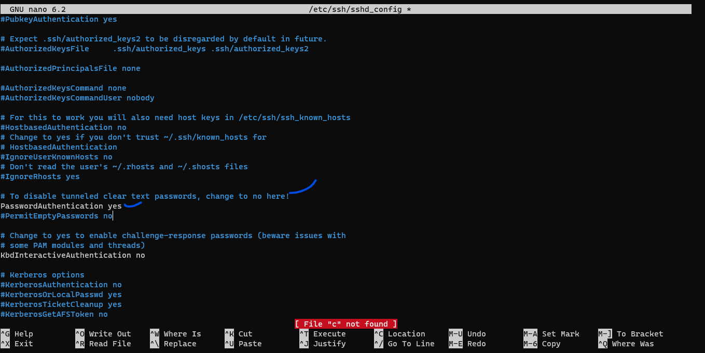
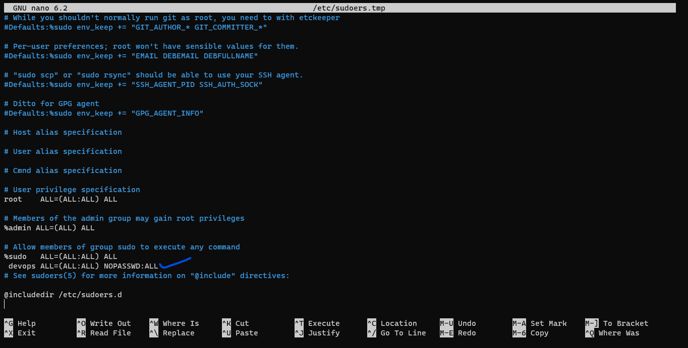
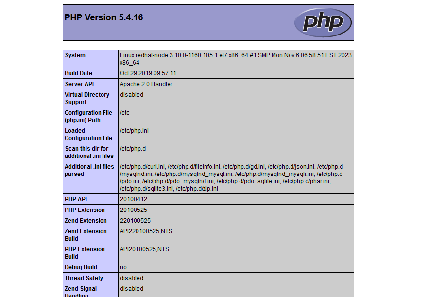
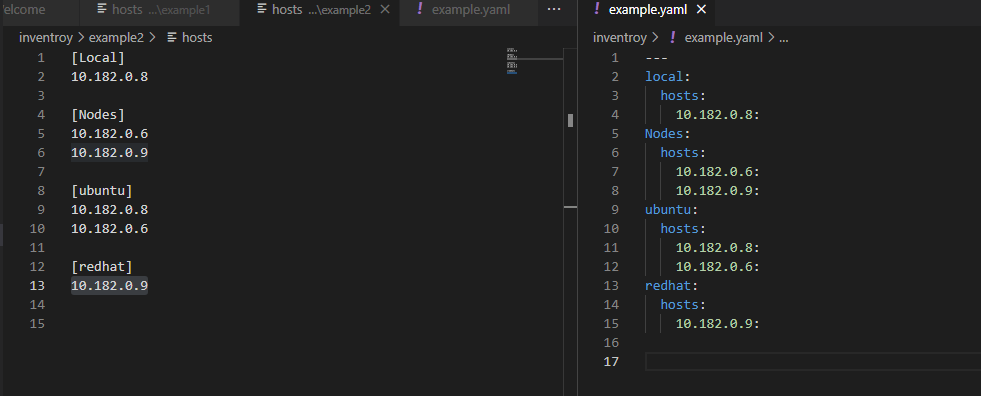
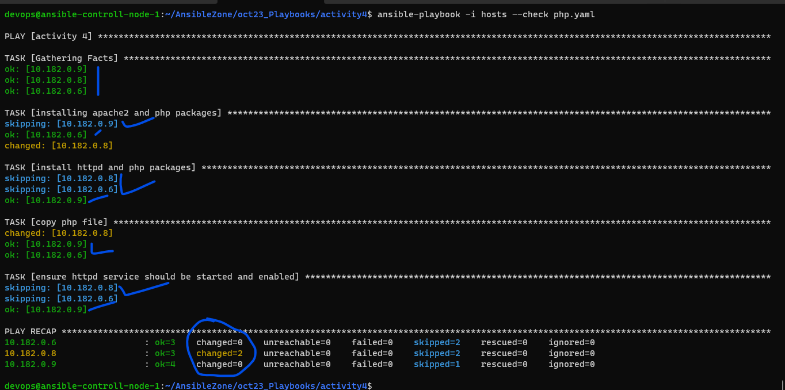
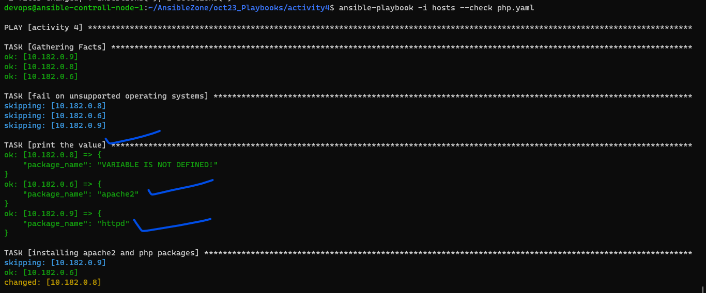
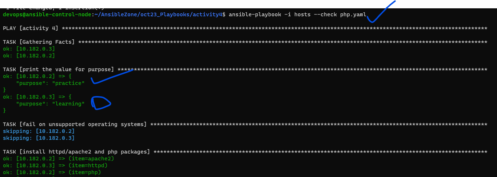

Ansible Introduction
---------------------
* [Refer Here](https://www.ansible.com/) for Ansible official docs
* Ansible is majorly used in DevOps to deploy applications into servers across various environments.
* Ansible in CI/CD pipeline is called by some engine for example => (Jenkins => Ansible, AzureDevOps => Ansible …)
### Configuration Management types:
   * **pull based CM:**
     * Nodes will communicate with CM Server to deploy configuration
     * For this to happen, We need to
       * install agent software on node and configure it to connect to the server to communicate with CM.
     * **Examples:**
       * Chef
       * Puppet
         * Works on agent base and using puppet/chef agent 
         * agent pulls the agent configuration 

   * **push based CM:**  
      * CM Server communicates with Nodes to deploy configuration
      * For this to happen we need details such as
         * ip address of node
         * credentials of node

      * **Examples:**
        * Ansible
        * Salt 
   * **Ansible:**
      * no agent needed works on SSH
      * not complex 
      * it pushes the configuration 
      * it works on credentials 
      * it is agent less   

      

### Ansible Execution Approaches/can use in two ways
  * Ansible Ad-Hoc Commands
     * [Refer Here](https://docs.ansible.com/ansible/latest/command_guide/intro_adhoc.html)
     * it is used for one time activity/non repetitive tasks
     * This uses the following structure below
    ```
    ansible -i hosts  -m [module-name] -a "[arguments]" 
    ansible -i hosts -m shell -a "cat/ect/passwd/"
    ``` 
  * Ansible Playbooks
     * [Refer Here](https://docs.ansible.com/ansible/latest/playbook_guide/playbooks_intro.html)
     * It is used for repetitive tasks and This is yaml representation of sequence of commands

       `ansible-playbook -i hosts playbook.yml`

### Declarative vs Procedural
* Understanding Declarative vs Procedural


* In Declarative programming, we define what we want is(desired state).
* The job of the tool is to ensure desired state is met every time during execution.
* **Idempotence:**
    * The result of execution of CM Script is same when we execute it once or multiple times
* **Configuration Drift:**
    * is known as Difference between desired state and actual state.

### Ansible Architecture
  * Overview
  

### Components:
  * **Ansible control node:** This is where ansible is installed
  * **Nodes:** This is where we want to perform deployments
  * **Inventory:** list of nodes and their information like ip address
  * **Playbook:** Where we write instruction What has to be done on the node
  
### Workflow:
  * We develop playook and specify inventory and execute the playbook on ansible control node
  * Now ansible tries to establish connection to node
  * Now the ansible playbook is executed with the help of python on node.

### Authentication in Linux or Credentials
  * Linux uses SSH (Secure Shell) for connecting to other instances
  * There are two types of Authentication/credentials
    * username and password
    * username and key pair

### Procedure to Transfer ID_RSA Private/Public Key from our local terminal to VMS 

```
# this below command says transfer id_rsa key to particular server with their server username and public ip
sftp -i .\id_rsa_AjaykumarRamesh dell@34.16.183.64
# which file to transfer
put id_rsa_AjaykumarRamesh
# output below
Uploading id_rsa_AjaykumarRamesh to /home/dell/id_rsa_AjaykumarRamesh 100% 3389 15.0KB/s   00:00 id_rsa_AjaykumarRamesh
# then say 
bye
```
* Check this below id_rsa key file has been transferred to server

* Now Ansible controller server can connect to node-1 but before that needs to change the id_rsa file permission to `chmod 400 id_rsa_AjaykumarRamesh`
* because id_rsa key file are too open for others users can misuse it.
* Now then login from ansible controller server and access the node-1

`ssh -i id_rsa_AjaykumarRamesh dell@10.182.0.6`
* Observe the below screen shot


### Lab Setup:
 * Overview
 
* We will create a user called as `devops` on `ansible-controller` and `node-1`
* Enable password based authentication since in 
AWS it is disabled
* Try to login from `ansible-controller` to `node-1` using devops user

### Solutions:
* In Ansible-Controller server:
* Enable password based authentication
  * check the value of PasswordAuthentication in file called `/etc/ssh/sshd_config` and change it to `yes` 
  
    `sudo nano /etc/ssh/sshd_config`
  * before changing
  
  * After changing
  

  * Restart sshd 
  
    `sudo systemctl restart sshd`
* Create a user called as `devops`

     `sudo adduser devops`
* Now repeat the same above steps on `node-1`
* Now connect from our laptop to VMS by using `username` and `password` not required to give `-i option and id_rsa` since we have username and password
```
ssh username@ip-addresss
ssh devops@34.125.18.117
```
* Now from `ansible-controller` connect to `node-1` 
```
ssh devops@<public-id-address/private-ip-address>
ssh devops@10.182.0.6
```

### Setting up password less authentication between linux machines
* **Steps:**
  * create two VMS called `ansible-controller` and `node-1`
  * create users called `devops` in Two VMS
  * Enable password based authentication for two VMS in file called `/etc/ssh/sshd_config` and change it to `yes`
    * Restart sshd  `sudo systemctl restart sshd`
  * Add two VMS users to `sudoers file` or `sudoers group`  
    * In this case we will be editing sudoers file directly
    ```bash
    sudo visudo
    CTRL X => to save the file after edit
    ```
    * Refer Below screen shot for saving the file
    
    * Check whether `devops` user has sudo permission  in two VMS or not
    ```bash
    su devops
    cd ~
    pwd
    sudo apt update
    ```
  * Generate key pair from `ansible-controller`
    ```bash
    ssh-keygen -t rsa -b 2048
    ``` 
    
  * Now copy the public key from `ansible-controller` into `node-1`
  ```bash
  ssh-copy-id <username>@<noe-1-private-ip-address>
  ssh-copy-id devops@10.182.0.6
  ```
  
  * Now Login into `node-1` and check whether public key is copied 
  ```bash
  cd ~
  ls -al
  cd .ssh/
  ls
  cat authorized_keys
  ```
  
  * After the ssh-copy-id is success, then we can login directly by using ip address as both machines have same username and password less authentication is setup
  ```
  ssh <node-1-private-ip>
  ssh 10.182.0.6
  ```
  

### Ansible setup:
* we have two machines with common user devops with sudo permissions and password less authentication setup between `ansible-controller` and `node-1`
* Ensure python 3 is installed on both server
   
   `python3 --version`
* [Refer Here](https://docs.ansible.com/ansible/latest/installation_guide/index.html) for Ansible installation guide
* We have two approaches to install ansible
   * using python
      * [Refer Here](https://docs.ansible.com/ansible/latest/installation_guide/intro_installation.html#installing-and-upgrading-ansible-with-pip)
   * using package managers like apt or yum (dnf)
      * [Refer Here](https://docs.ansible.com/ansible/latest/installation_guide/installation_distros.html#installing-ansible-on-ubuntu)
```bash
sudo apt update
sudo apt install software-properties-common
sudo add-apt-repository --yes --update ppa:ansible/ansible
sudo apt install ansible -y 
ansible --version
```      

* Overview


### Test ansible connectivity from ansible controller to node-1
* Create a file with `node-1` ip address in it
 ```
 echo 34.16.190.235 > hosts
 cat hosts
 ```
 
* execute the following command `ansible -i hosts -m ping all` or `ansible -m ping -i hosts all`
 

### Adding users to sudo
* [Refer Here](https://linuxize.com/post/how-to-add-user-to-sudoers-in-ubuntu/) for debian based systems
* [Refer Here](https://developers.redhat.com/blog/2018/08/15/how-to-enable-sudo-on-rhel) for redhat based systems

YAML
----
* This is data representation language which uses name values
```
<name>: <value_pair>
   or
<key>: <value_pair>  
```
* YAML is inspired from python, so indentation’s become mandatory
* YAML files generally have `.yaml` or `.yml` as extensions
* Lets categorize data
   * Scalar/Simple
      * text 
      * number
      * boolean
   * Complex
      * list/array
      * map/dictionary/object

#### Ansible Playbook Syntax:
* [Refer Here](https://docs.ansible.com/ansible/latest/reference_appendices/YAMLSyntax.html) 

* Sample Yaml Syntax:
```yaml
---
name: test
mobile: '999999999'
email: test@test.com
CareerObjective: |
  A motivated individual with in-depth knowledge of languages 
  and development tools, seeking a position in a growth-oriented 
  company where I can use my skills to the advantage of the 
  company while having the scope to develop my own skills.
ProfessionalSummary:
  - Involved in designing CI/CD pipleines
  - Hands on experience in Develpoing Ansible playbooks
Skills:
  os:
    - windows
    - linux
  cm:
    - Ansible
  container:
    - Docker
Work experience:
  - company: xyz limited
    duration: Dec 2021 - present
    designation: DevOps Engineer
    RandR:
      - Ensuring Pipelines are healthy
      - Developing playbooks
  - company: abc limited
    duration: Dec 2019 - Dec 2021
    designation: DevOps Engineer
    RandR:
      - Ensuring Pipelines are healthy
      - Developing playbooks
```
### Basic structure of Ansible playbook
```yaml
---
- name: <name of playbook - text>
  hosts: <where to execute-text>
  become: <need sudo permissions -bool>
  tasks: # <list of task>
  - name: Ensure apache is at the latest version # name of task
    ansible.builtin.yum: # module name
      name: httpd # module arguments
      state: latest # state
```

* Ansible Playbook structure:


### Lets create a simple playbook
  * Goal: create a file @ `/tmp/1.txt` 
  * manual Command:
 
     `touch /tmp/1.txt`
  * where to execute: all machines
  * Approximate playbook
  ```yaml
  ---
  - name: create file play
    hosts: all
    become: no
    tasks:
    - name: create a file
      ansible.builtin.file:
      path: /tmp/1.txt
      state: file 
  ```
Ways of Working in Ansible
---------------------------
* Figure out the manual steps
* Execute and verify if they are working
* for each manual step findout an ansible module which can help

Ansible Module
--------------
* this is the smallest unit of work in Ansible
* Module takes some inputs which are generally referred as parameters and it has state
* Ansible modules [Refer Here](https://docs.ansible.com/ansible/2.9/modules/list_of_all_modules.html)

### Activity: install apache server on node 1
* manual steps: [Refer Here](https://www.digitalocean.com/community/tutorials/how-to-install-the-apache-web-server-on-ubuntu-22-04)

```bash
sudo apt update
sudo apt install apache2 -y
```
### Way of Finding modules:

* [Refer Here](https://github.com/codesquareZone/AnsibleZone/commit/076dfe292ae06007f36635375fa2a066da1cf076) for apache-2 yaml file
* **Ansible Playbook Execution Approach:**
* Ansible to take help
 
  `ansible-playbook --help`
  * **Syntax check:**

    `ansible-playbook -i hosts --syntax-check apache.yaml`
    
  
  * Check the execution like (dry run). Note this is not always correct

    `ansible-playbook -i hosts --check apache.yaml`
     

  * Now lets execute the playbook
  
    `ansible-playbook -i hosts apache.yaml`   
    
  * Now installed apache2 on `node-1` with our yaml file
  

  * Now Lets re-run the ansible playbook, it will not do nothing since ansible is `idempotent`
  

### Activity 2: Install php on apache server
* Manual steps:
```
sudo apt udpate 
sudo apt install apache2 -y
sudo apt install php libapache2-mod-php php-mysql -y
```
* Lets create a file `/var/www/html/info.php` with the following content below
  
        <?php phpinfo(); ?>
* [Refer Here](https://github.com/codesquareZone/AnsibleZone/commit/8f897fb75b7b974407a650bca3e7db31c1b37e26?diff=split&w=0) for php yaml file
* Execute ansible playbook after syntax check and check
```
# syntax check
ansible-playbook -i hosts --syntax-check php.yml
# check 
ansible-playbook -i hosts --check php.yml
# Execute playbook
ansible-playbook -i hosts php.yml
```

* Now access `http://publicip/info.php` and `http://34.125.18.117/info.php`


### Activity 3: Perform the activity2 on redhat
* I need to setup/create a redhat vm with devops user and passwd
* Enable password authentication to yes in this file called `/etc/ssh/sshd_config` and Restart `systemctl restart sshd`
* Add devops user to sudoers group
* Copy the `ansible controller` public key to `Redhat-node`
```
ssh-copy-id devops@10.182.0.9
ssh-copy-id devops@<redhat-node-private-ip>
```
* manual steps:
```
sudo dnf install httpd -y
sudo dnf install php php-cli php-common php-gd php-mysqlnd php-pdo -y
```
* Lets create a file /var/www/html/info.php with the following content
  `<?php phpinfo(); ?>`
* [Refer Here](https://github.com/codesquareZone/AnsibleZone/commit/c8f5e1504266907f177a42f62f65034e3da34f60) for redhat yaml file
* Execute ansible playbook after syntax check and check
```
ansible-playbook -i hosts --syntax-check redhatphp.yaml
ansible-playbook -i hosts --check redhatphp.yaml
ansible-playbook -i hosts redhatphp.yaml
```

* In Redhat Linux Distribution after installing httpd we needs to start the service and enable it for next time restarting the service means by automatically service should start so we need to add one more line of yal for service to start


* [Refer Here](https://github.com/codesquareZone/AnsibleZone/commit/b935c11f6d7f0b37dc642c44e033650152036144) for service yaml file


* Now Access the application `http://34.125.107.165` and `http://34.125.107.165/info.php`



Inventories in Ansible
-----------------------
* Inventory is collection of nodes.
* Inventory is of two types
   * Static
   * Dynamic
* **Inventory can be written in two formats:**
    * ini format
    * yaml format
* **ini format:**
```
ipaddress/name

[group1]
ipaddress/name
ipaddress/name

[group2]
ipaddress/name
ipaddress/name
```
* [Refer Here](https://github.com/codesquareZone/AnsibleZone/commit/5ba26591b77eef4718e68970bdeaf02ef543be03) for sample inventories in ini format

* [Refer Here](https://github.com/codesquareZone/AnsibleZone/commit/89fa37d5241ec9fac3f3054e932cbef4582dd35c) for sample os groups of inventories in ini format


* [Refer Here](https://docs.ansible.com/ansible/latest/inventory_guide/intro_inventory.html#defining-variables-in-ini-format) for inventory documentation
* Yaml Inventories Examples
* [Refer Here](https://github.com/codesquareZone/AnsibleZone/commit/c7708b477acd2fa0bfef48de40ccd995f944e5d6) 



### Ansible Facts
* it will collect some information about client server/nodes like `operating systems, IP addresses, attached filesystems,` and many more. by using  `module` called `setup` and it will gather all the information to Ansible controller, this is known as Ansible Facts
* For `Module Setup` [Refer Here](https://docs.ansible.com/ansible/latest/collections/ansible/builtin/setup_module.html)
* Example of ansible collecting facts
```
ansible -i example2 Nodes -m setup
```
 * [Refer Here](https://github.com/codesquareZone/AnsibleZone/commit/c22375b95aa9a7a164b4bae9e46f2d73dfb33201) for ansible_facts output
* To Filter the output 

  `ansible -i example2 all -m setup -a "filter=*ansible_os_family"`


### Activity 4: Lets write one playbook for installing php in both redhat and ubuntu
* using Ansible facts with `when` conditionals statement installing `php` on both `ubuntu` and `Redhat` os
* [Refer Here](https://docs.ansible.com/ansible/latest/playbook_guide/playbooks_conditionals.html) when conditional docs
* [Refer Here](https://github.com/codesquareZone/AnsibleZone/commit/7a36920591442584d71457ce94a15876cdda050d) for when conditions yaml file
   * [Refer Here](https://github.com/codesquareZone/AnsibleZone/commit/be9dbb2aa2165d8609ccd93a34949f21332e7c09) for when conditions yaml file added error fix


* **Add a failback message for unsupported operating systems:**
* By using `msg` module we will resolve this issue
   * [Refer Here](https://docs.ansible.com/ansible/latest/collections/ansible/builtin/fail_module.html) for  failing execution with msg module
* [Refer Here](https://github.com/codesquareZone/AnsibleZone/commit/2f20facdb52173efa7ceb4b6d5fc1d0ae52e024b) for msg yaml file

* **Lets parametrize using Ansible variables with help debug module:**
* [Refer Here](https://docs.ansible.com/ansible/latest/playbook_guide/playbooks_variables.html) for ansible variables docs
* [Refer Here](https://docs.ansible.com/ansible/latest/inventory_guide/intro_inventory.html#adding-variables-to-inventory) for Adding variables into inventory docs 
* [Refer Here](https://docs.ansible.com/ansible/latest/collections/ansible/builtin/debug_module.html) debug module docs 
* **debug module version-1:**
* [Refer Here](https://github.com/codesquareZone/AnsibleZone/commit/616a9ed107d669b22921e34c738ef67973d90845) for debug yaml file

* **debug module version-2:**
* [Refer Here](https://github.com/codesquareZone/AnsibleZone/commit/23bfed88e8f2f9d25479db47325828ebcdcfe807) for using debug module added variables

* [Refer Here](https://github.com/codesquareZone/AnsibleZone/commit/bc47331713ee03ce7131a3d9ac200dd01b00b6fc) for using debug module added variables
* ** Generic OS package manager:**
* [Refer Here](https://docs.ansible.com/ansible/latest/collections/ansible/builtin/package_module.html) for generic package manager official docs
* Lets use generic package manager, by using this generic os package manager instead of we using `apt for ubuntu` and `yum/dnf for Redhat` like multiple module, we can use only one package manager called `package` module, so that if it ubuntu it will take `apt` nor if it is Redhat it will take `yum/dnf`
* [Refer Here](https://github.com/codesquareZone/AnsibleZone/commit/fde1a2f23f940faa1a9f73b0792074477071a866) for Generic packages module yaml file
* **Loops Concept:**
* [Refer](https://docs.ansible.com/ansible/latest/playbook_guide/playbooks_loops.html) for Loops docs
* Now Lets use Loops concept to install multiple packages
* [Refer Here](https://github.com/codesquareZone/AnsibleZone/commit/9f462e87dc23cdf7ce3b42f342e7f4577b696a3c) for loop in yaml file
* Finally using loops and package module installed required packages on ubuntu and redhat


* **Adding variables directley in the yaml file:**
* refer this below examples of yaml file but this variables works only for ubuntu not for redhat because we have added variables in yaml only for ubuntu packages

```yaml
---
- name: activity 4
  hosts: all
  become: true
  tasks:
  - name: fail on unsupported operating systems
    ansible.builtin.fail:
      msg: "This playbook will work on Debian and RedHat Only"
    when: ansible_facts["os_family"] != "Debian" and ansible_facts["os_family"] != "RedHat"
    vars:
      all_packages:
      - apache2
      - php
      - libapache2-mod-php
      - php-mysql
      ackage_name: apache2 
- php-mysql
  - name: print the value
    ansible.builtin.debug:
      var: all_packages   
  - name: install httpd/apache2 and php packages
    ansible.builtin.package:
      name: "{{ item }}"
      state: present  
    loop: "{{ all_packages }}"       
  - name: copy php file
    ansible.builtin.copy:
      content: <?php phpinfo(); ?>
      dest:  /var/www/html/info.php
  - name: ensure httpd service should be started and enabled
    ansible.builtin.service:
      name: "{{ package_name }}"
      state: started
      enabled: true
```

* **Using group vars and host vars installing the packages for ubuntu and redhat:**
* Note:
   * group vars file name should be group name exactly
   * host vars file name should be ip name or dns name exactly 
* [Refer Here](https://github.com/codesquareZone/AnsibleZone/commit/c671a63fad499227607e5c2e46290908c3ee8a85) for group and host variable yaml file

* So here we have defined group variable and host variable but highest priority it will take first for host variable ans also we called in php.yml file host variable only by using debug module.
* **Now to call group variable:**
 * to call group variable in php.yaml file we will be changing host variable to group variable in debug module
 * so in gorup there two hosts so for that host it will call only group variable
* [Refer Here](https://github.com/codesquareZone/AnsibleZone/commit/43dcc88dfac8e82d4c3d86fe3328c3975ab788f1) for group variable yaml file

* **Examples: that host level variable has higher priority:**
 * here in this examples we are calling group level variable but for one host i have changed group varaible to different value so let see what it prints 
 * `10.182.0.2` for this ubuntu host i have changed to purpose to practice and other host same purpose to learning 
 * let us see the output 
 
* [Refer Here](https://github.com/codesquareZone/AnsibleZone/commit/be3194604cefdb53d5682940281c4815972c21d7) for changes host variable yaml file
* **Examples:** for executing variable in the commandline while executing ansible playbook by using command called `-e` because in ansible variable highest priority is given to `-e variable`
* Lets us see result while executing 

`ansible-playbook -i hosts -e purpose="nothing" --check php.yaml`

* **Finally:**
   * **Group level variable:** can be used comman to all the host means list of host which is there in that group and also group level variable will be applicable to all the elements in the groups 
   * **Host level variable:** can be used only for host elements means particular host only applicable that packages
* **For Example group level variable:**
    * refer below yaml file format
```webserver.yaml
---

purpose: learning

all_packages:
- apache2
- php
- libapache2-mod-php
- php-mysql
package_name: apache2 
```
* **Varaibles Rules in Ansible:**
  * `-e` passing the variables while executing playbook will be given highest priority
  * Host level variables will be given second highest priority
  * Group vars variables will be given third highest priority
  * vars variables which will be defined in the yaml/playbook file will be given forth highest priority


Activity 5: Install tomcat 10 server
-------------------------------------
* **Target environments:**
  * ubuntu
  * redhat
* **References docs:**
  * ubuntu [Refer Here](https://linuxize.com/post/how-to-install-tomcat-10-on-ubuntu-22-04/)
  * redhat based [Refer Here](https://linuxize.com/post/how-to-install-tomcat-9-on-centos-7/)

* **Ubuntu Manual Steps:**
```bash
sudo apt update
sudo apt install openjdk-11-jdk -y
sudo useradd -m -U -d /opt/tomcat -s /bin/false tomcat
# wha this above third command says is => create user with following information
# username = tomcat
# group = tomcat
# homedir = /opt/tomcat
# shell = /bin/false
MAJOR_VERSION="10"
VERSION="10.1.17"
wget "https://dlcdn.apache.org/tomcat/tomcat-${MAJOR_VERSION}/v${VERSION}/bin/apache-tomcat-${VERSION}.tar.gz" -P /tmp
# This above command uses variable concept and download tomcat tar to /tmp
# file path: /tmp/apache-tomcat-10.1.14.tar.gz
sudo tar -xf /tmp/apache-tomcat-${VERSION}.tar.gz -C /opt/tomcat/
# extract tar file to /opt/tomcat
sudo ln -s /opt/tomcat/apache-tomcat-${VERSION} /opt/tomcat/latest
# Create a link for /opt/tomcat/apache-tomcat-10.1.14 to /opt/tomcat/latest
sudo chown -R tomcat: /opt/tomcat
# change the ownership for folder /opt/tomcat
sudo sh -c 'chmod +x /opt/tomcat/latest/bin/*.sh'
# Add execute permissions in bin directory for shell files
```

* Creating service files will be done at a later point of time

### Ansible implementations
* writing playbook and executing for above manual steps 
* [Refer Here](https://github.com/codesquareZone/AnsibleZone/commit/3698929d5f49c642582553099b781f38f8461ce8) for yaml file install java creating user and group  
* We ran into issue [Refer Here](https://github.com/codesquareZone/AnsibleZone/commit/3f075e3743ad741d7f8a98fe095913c2d955a383)  for the fix
* After checking syntax and dry run, execute the ansible playbook
```
ansible-playbook -i hosts --syntax-check tomcat.yaml
ansible-playbook -i hosts --check tomcat.yaml
ansible-playbook -i hosts tomcat.yaml
```

* [Refer Here](https://github.com/codesquareZone/AnsibleZone/commit/8ecdd7d1ed33f8eb2912228f5f6ec73c09f5145a) for download the tomcat version yaml file


