# AzureDevOps:

* Azure DevOps was earlier called as Visual Studio Team Services
* Azure DevOps offers services to
   * manage agile projects
   * test management
   * Pipelines

* **Features of Azure DevOps:**
  * **Management:**
     * Azure Boards
     * Agile Management
  * **Testers:**
     * Test Management
  * **DevOps:**
     * Pipelines
  * **Developer:**
     * Version Control System

* Azure DevOps Features Artitecture:
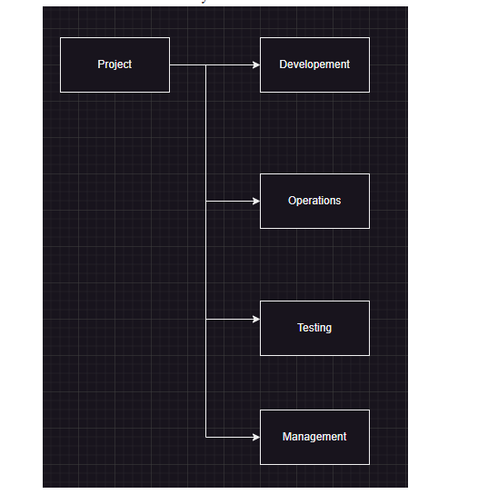

### Azure DevOps setup:
* **Azure DevOps Server:**
  * We need to install azure devops software on Windows Servers
  * we needs to manage this azure devops software
* **Azure DevOps Services:**
  * This is already hosted by microsoft
  * We have just use by creating account
  * We can create account using
    * GitHub
    * Microsoft Account

### AzureDevOps Plans:
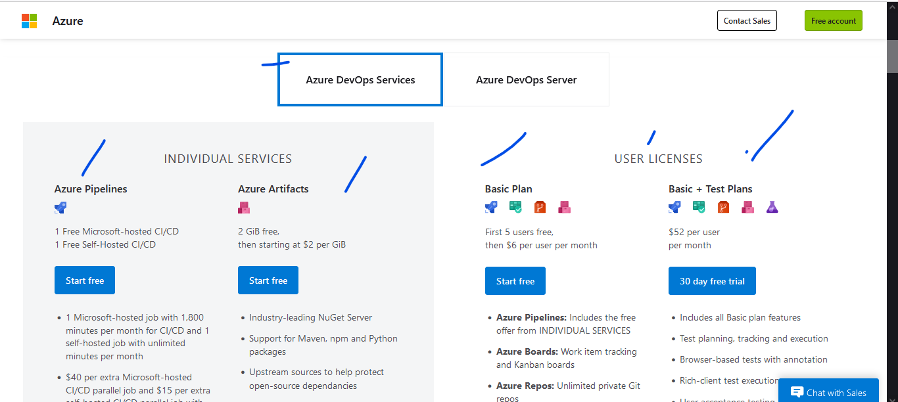
 * Free:
   * 1 Free Microsoft-hosted CI/CD (1800 minutes/month)
   * 1 Free Self-Hosted CI/CD
   * Azure Source Repos => free
   * Azure Artifacts 2 GB

* **Azure DevOps Account Creation Steps:**
  * if you have github account then login with it start free
  * if you have microsoft account or azure cloud account then login with it
  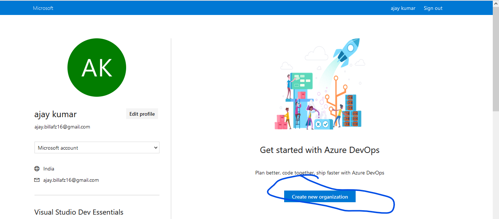
  
  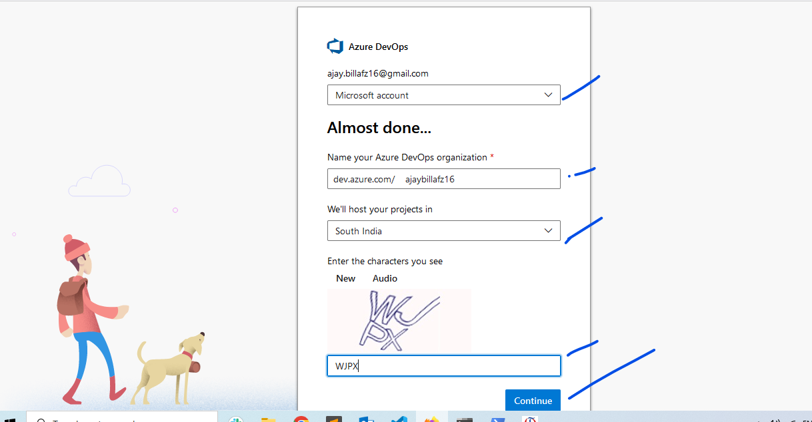
  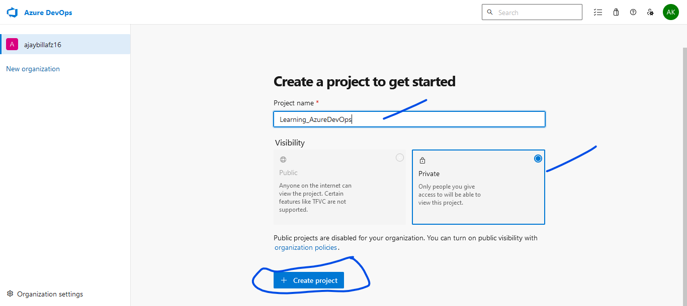
  
* All Is Well Done Account Creation

### High level overview AzureDevOps:


* **AzureDevOps Services offered:**
  * **Wiki:**
     * we can create all the project related documentation for go through or for new comer to team to have overview of projects
  * **Boards:**
     * Its kind of jira, we track the work and create ticket and assign to team members  
     * Below Options avaiable:
       * product backlog
       * sprint backlogs
       * burn down charts
       * Scrum board  
     * **Azure Repos:**
        * Here manage all the source code/store all the source code of the projects
     * **Azure Pipelines:**
        * This is to manage CI/CD PipeLines and Execute our pipelines of the projects
     * **Azure Test Plans:**
        * Test management i.e. Test cases, executions, defects and reports are managed here
     * **Azure Artifacts:**
        * Here stores all build packages
        * After building the packages during the running of pipeline which will be getting artifacts/war/ear files will be stored here.

### DevOps pipeline High level overview                 
* Why do we need to do Continuous Integrations?
  * We do Continuos integrations multiple times in a day from day 1 of the project so that we can avoid surprises during big bang integrations.
  * Which means to avoid the issues the end of the closure of the project or sprints
* To perform automated integrations we need tools
  * build/package the code
  * run the tests
  * evaluate the test results  

* The idea is perform continuous integration for almost every change submitted by developer(s)
* This practice is recommended to avoid integration failures during later stages of the project
* Big bang integration leads to lot of technical debts.
* Continuous integration ideal workflow:
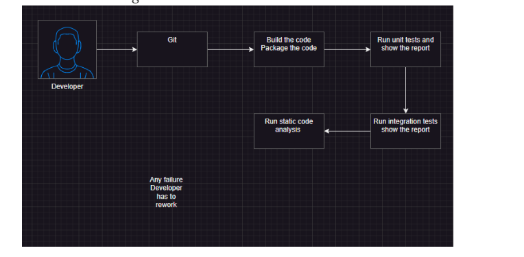
* The idea of Continuous integration is do give immediate feedback to the developer, about code status.

### Unit Tests:
* This generally represents smaller tests which test functionality at a unit level.
* Developers are responsible for developing unit tests
* With every change done by developer all the unit test needs to be executed and reports should be shown.
* For executing unit tests, each platform has multiple tools like below:
  * java: junit
  * dotnet: mstest, nunit
  * javascript: mocha, jasmine
  * python: pytest

* We need to show the test results with every change.
* here there is some trick with developers because they write unit tests something like below:
  ```py
  assert True == True
  ```
   * so this means this above line in the code says unit test will never fail in entire life, so to over come this issue or from developers tricks we have something called `Code Coverage tools`  
* Code Coverage tools should be included with test runs and code quality reports.
* Some organizations fail the builds based on these results which are often represented as Quality Gates.
* Notify the team via email/slack/teams the results of the build.
* CI pipelines start from source code repositories and end with artifact repository

### Terms:
* **Repository:** 
   * This represents a storage and it also has ability to store versions and history of changes.
* **Source Code Repository:**
   * This repository is used for storing code. This maintains history of every change that is done
   * **Examples:**
      * Git
      * Subversion
      * TFC
      * Perforce
* **Artifact:** 
   * Result of the build package.
* **Artifact Repository or Package Repository:** 
    * This repository is used for storing build packages/artifacts
    * **Examples:**
       * Jfrog/Artficatory
       * Nexus
       * **Docker:**
          * Container registries
     
### Difference between unit test and integration test:
* Unit test: means what developer written the code will test by developer, means test the entire code.
  * For an Example: in shopping cart add or remove the product checking in the order or cart this is known as unit test
* Integration test: means testing on all dependencies of what ever developer wrote the code.
  * For an Example: if a shopping cart the payment has done then order should be completed so there is some communication between payment and order this is known as integration test, how we will write the test from shopping cart we will write dummy order and then try to finish it, we are trying to test two components dependencies. 

### What does it mean to build the code:

* Developers write code using high level languages, but systems understand low level.
* To do this conversions we have three options:
  * **Compiler:**
    * High level to low level before executing the application.
    * Per Operating system we have a different release
  * **Interpreter:**
    * High level to low level during application execution.
    * Releases are same for different os
    * In every os we need to install interpreter
### Hybrid:


Azure DevOps Pipelines:
-----------------------
* Azure DevOps has two ways of building pipelines:
   * Classic Pipelines
   * Azure Pipelines YAML

* **Classic Pipelines:**
   * We rely on user interface(UI)
   * Like jenkins freestyle(UI)
     * **_Drawback:_**
       * History will be missing
     * **_Advantages:_**
       * Easy to start
* **Azure Pipelines YAML:**
   * Pipeline as Code. 
   * We will define pipelines steps in a file `azure-pipelines.yaml` and add it to the version control system (git)
   * Like jenkins pipeline projects and `azure-pipelines.yaml` is like a `(Jenkinsfile)`
     *  **_Advantage:_**
        * History will be maintained
     * **_Disadvantage:_**
         * Learning curve for writing pipeline

* **Azure DevOps has agents:** 
   * Agent is where the build is executed.
   * Like jenkins node
* **There are two types of agents:**   
   * **_Microsoft Hosted agents:_**
      * which azure will create a agent for us and once build is completed it will delete the agent, but we needs to tel azure where is agent.
      * These are machines which will be created on demand by Azure DevOps and will be delete upon build completion.
   * **_Self Hosted Agents:_**
      * These are machines managed by us, we add these machines as agents to Azure DevOps.
      
### Classic AzureDevops Projects:
* Starting first classic azuredevops project
* **_Steps:_**  
  * Create a project
  * Select repos and Select drop down of Learning_AzureDevOps 
  * Select import respository
  
  * Provide git url of repo to clone
  * then click on import
  
  * Now it will copy/import spring-petclinic repo into ur azuredevops repo
  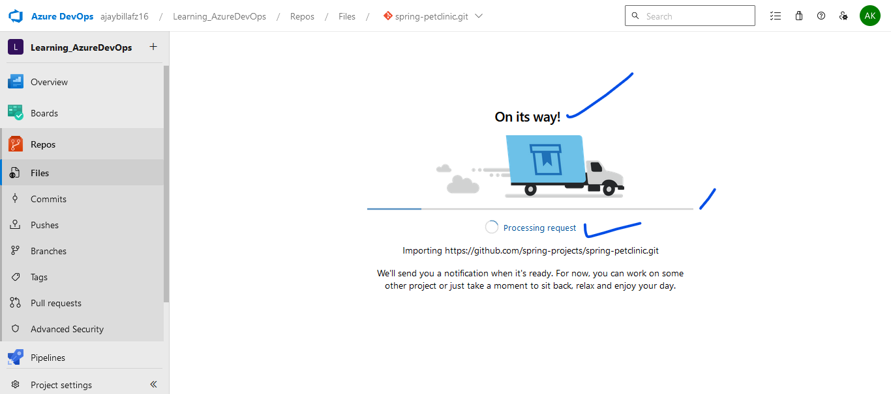
  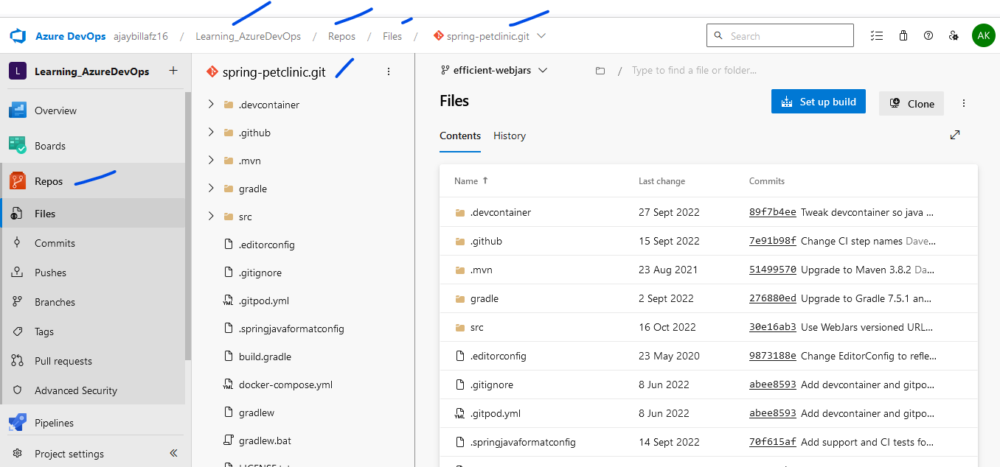
  * Set Main as default branch
  
  * Lets click on setup build 
  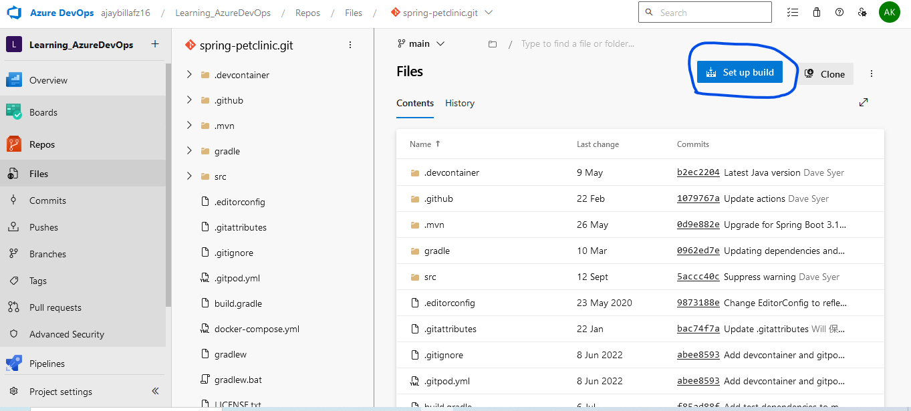
  * Now select maven since my build tools is maven to build the project/package
  * Now it will show us the yaml pipeline formate which is going to run with these yaml formate commands
  * so save and run
  
  * creating pipeline
  
  * So now created job and its status in queue
  
  * now got error since we dont have microsoft hosted agent nor self hosted agent.
  * To solve this error we need to raise parallelism request, azure will grant us the microsoft agent to run the job [Refer Here](https://aka.ms/azpipelines-parallelism-request)
  * Raising request steps:
  
  
  
  * Now after submitting the request azure will take two days to provision microsoft agent
  * so after two days azure will give free server that is known as microsoft agent.
  
  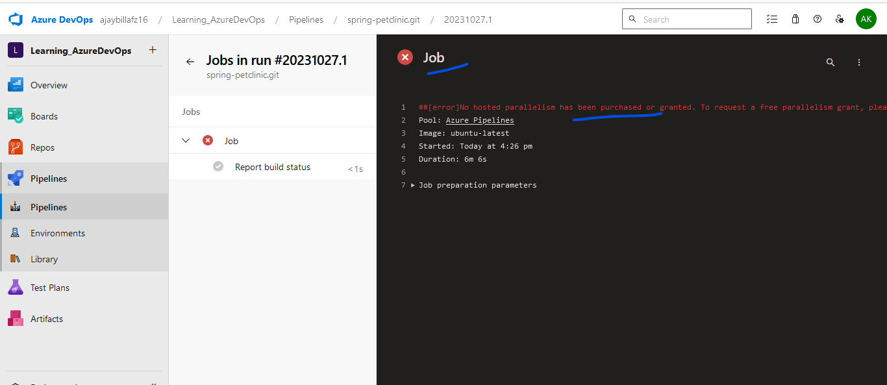
   
Configuring Self Hosted Agent in Azure DevOps:
---------------------------------------------
* Self Hosted Agent is the linux/windows/mac/our laptop instance managed by us


### Configuring Self hosted agents:
* Linux [Refer Here](https://learn.microsoft.com/en-us/azure/devops/pipelines/agents/linux-agent?view=azure-devops)
* Windows [Refer Here](https://learn.microsoft.com/en-us/azure/devops/pipelines/agents/windows-agent?view=azure-devops)
* Mac [Refer Here](https://learn.microsoft.com/en-us/azure/devops/pipelines/agents/osx-agent?view=azure-devops)

* To maintain collection of Agents, Azure has Agent pools. By default we will have two pools
  * default: for self hosted agents
  * Azure Pipelines: for Microsoft hosted agents

* Lets create self hosted agent as ubuntu linux vm and install, configure and run the agent

* **Steps:**
  * create ec2/vm 
  * Install required software to run the build for my project to run i needs openjdk-17

  ```bash
  sudo apt update
  sudo install openjdk-17-jdk
  sudo install maven -y 
  ```
  * go to azure devops UI select agent pools and click on default agent for self hosted and add the agent to run your project
 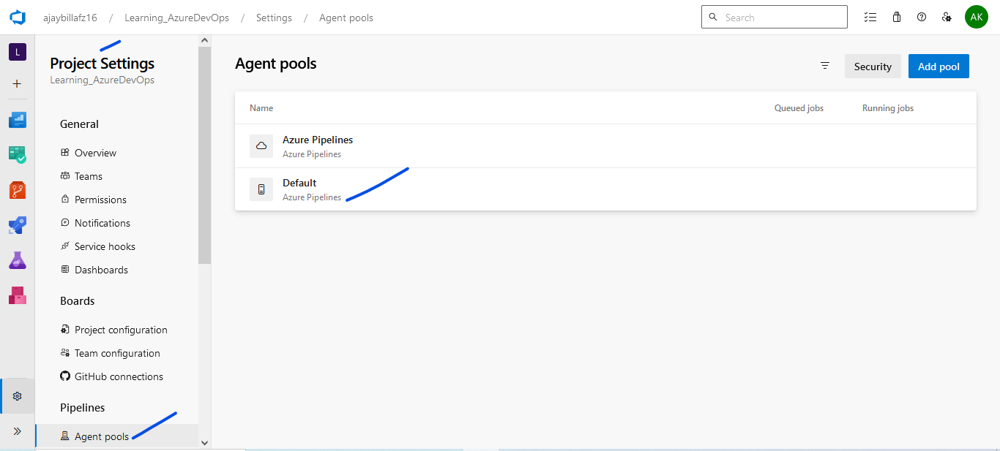
 * select default and click on agents and add new agent
 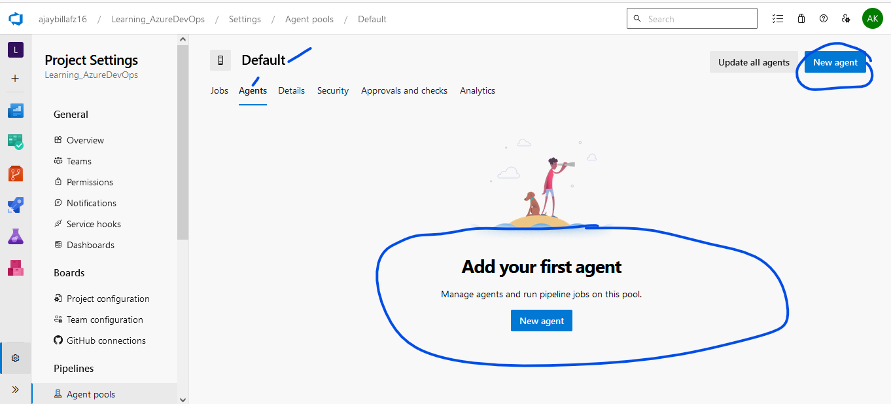
 * Now choose your agent based on your  machine.
 * i am choosing linux since i created ec2 machine with ubuntu linux
 
 * Now follow the steps in the screen shot or else ill put below also the steps just for reference

 ```bash
 # download the agent and configure
 cd /tmp
 wget https://vstsagentpackage.azureedge.net/agent/3.227.2/vsts-agent-linux-x64-3.227.2.tar.gz
# switch to home directory 
cd ~
# create a directory and switch to it
mkdir myagent && cd myagent 
# untar the downloaded tar file
tar -zxvf /tmp/vsts-agent-linux-x64-3.227.2.tar.gz 
# Configure the agent
./config.sh
# fill all the details after this above command and refer screen shot below
accept license agreement => enter => yes
Enter server url => https://dev.azure.com/ajaybillafz16
Enter authentication type for PAT => enter
Enter personal access token => qmr5hqob55642qj2hsjkda65fde6be4hexqt2qxidbm6ilzsyvnq
Enter agent pool => enter if default is your pool name, if not then provide your name of the pool
Enter agent name => enter for default name
Enter work folder => enter for default folder called _work
# finally only once to run then below command
./run.sh
# finally for ever to run then 
./svc.sh
```


* Now check agent is online
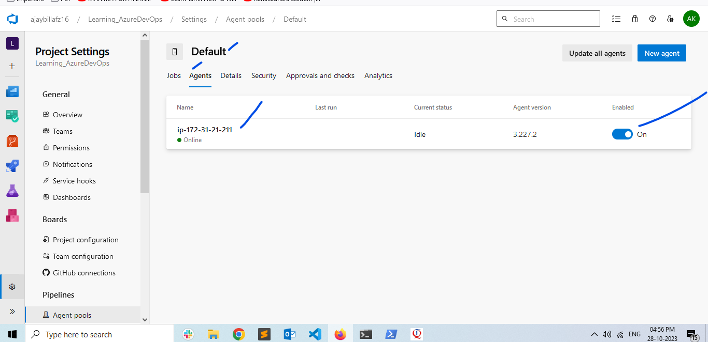 
* Now navigate to azure devops ui to azure pipeline

* Now we have to change the pools name in `azure-pipelines.yaml`
* navigate to repos 

* select `azure-pipelines.yml` and click on edit

* change pool name to `default` and commit the changes
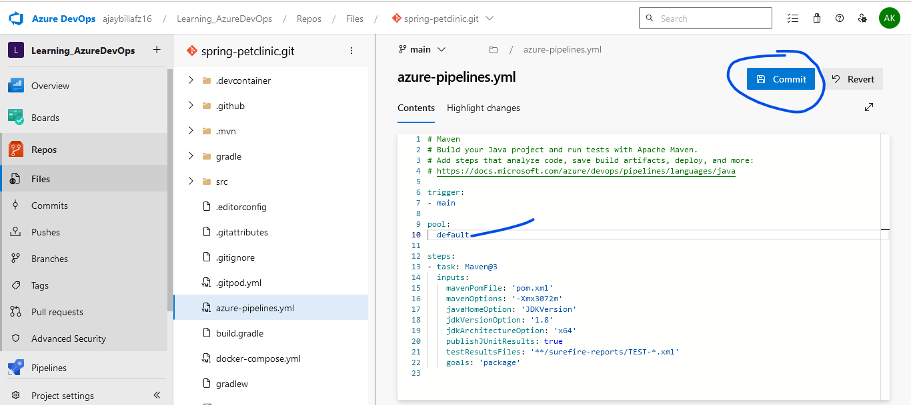

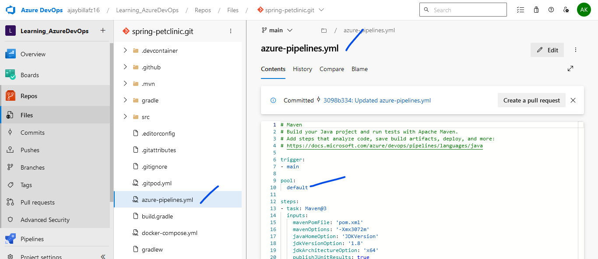
* after changing default pool name, this is another change refer screen shot

* Lets run pipeline again
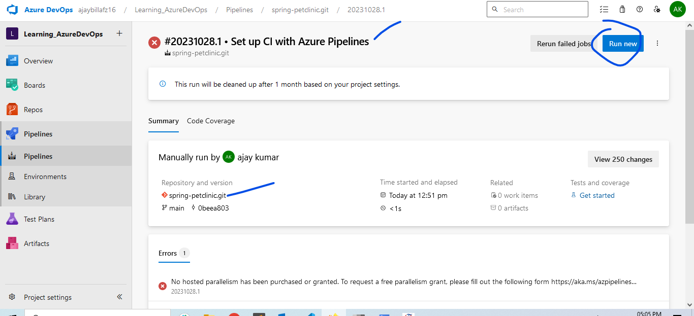
 
* For the first time it will ask for permission just provide it 
* click on view

* Click on permit

* where it is building the job in our server which we created and hosted/configured the self agent


* Build got success
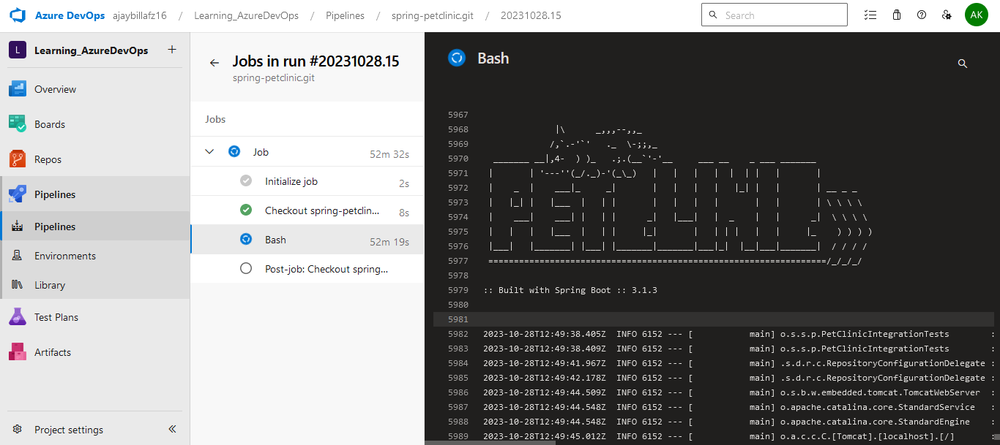

* **Steps to generate PAT:**
 * To Get Personal Access Token(PAT)
   * navigate to user setting right on top
  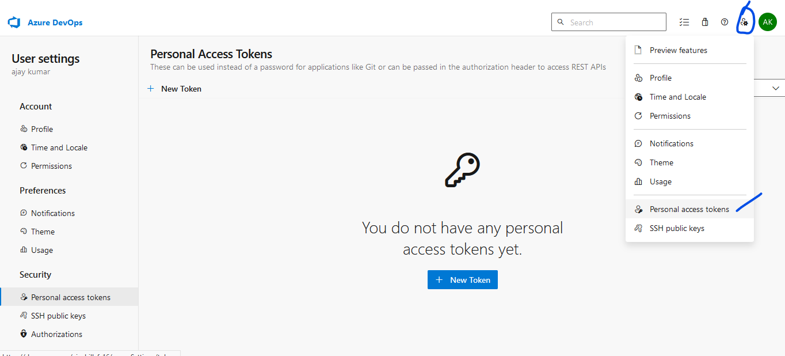
   * select PAT
   * click new token
  
   * select scopes/access with option 
     * full access
     * custom defined access (in companies most of we will use restricted access only)
   * Now here i am choosing full access
   * fill the details and click create
   
   * once token is created copy some where, if not after closing the window it not be see.
   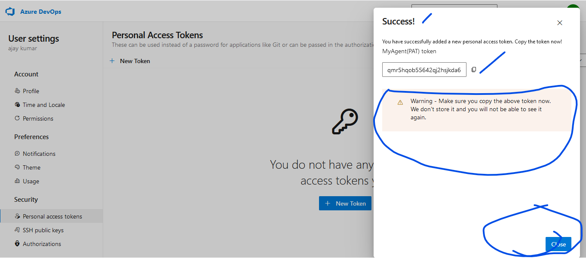
   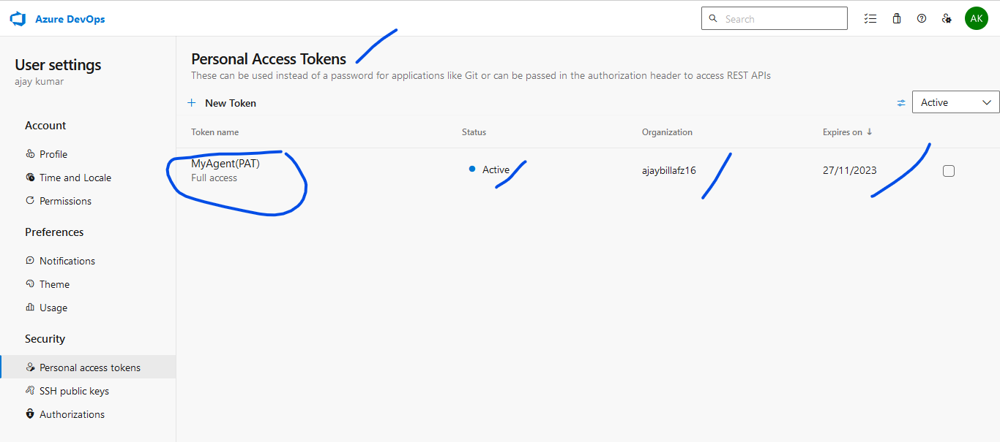

* Azure Pipelines are represnted in YAML Format. YAML is used as a Data representation format

### YAML Writing Method:
* YAML is name value pair collection
* syntax

`<name>: <value>`

* Value holds data and types of data are
* Simple/Scalar:
     * text: `course: AzureDevOps` or `course: "AzureDevOps"` or `course: 'AzureDevOps'`
     * number: `duration: 120`
     * boolean `online: yes` or `online: true`

* Complex:
   * list/array/plural
```yaml
tools: 
- git
- maven
- jfrog
- sonarqube
```

* object/map/dictionary
```yaml
address:
flat: 407
building: mytrivanam
street: ameerpet main road
area: ameerpet
landmark: metro
pincode: 500016
```

* Sample YAML:
  * Writing a resume:

```yaml
contact:
  mobile: 9999999
  email: info@qt.in
# here below pipe symbol represents as multiple text.
# if we needs to write or address multiple text then # we can use pipe symbol  
CareerObjective: |
    A motivated individual with in-depth knowledge of languages 
    and development tools, seeking a position in a growth-oriented 
    company where I can use my skills to the advantage of the 
    company while having the scope to develop my own skills.
ExpertiseAreas:
  - Project Management
  - DevOps
WorkExperience:
  - organization: Radiant Spark
    duration: 03/2014 - present
    designation: senior software engineer
    randr:
      - Eat healthy
      - Drink every night
      - sleep on time
  - organization: Technet
    duration: 03/2011 - 02/2014
```

* Now lets look at azure-pipelines.yaml sample:

```yaml
trigger:
  - main
pool: default
steps:
  - task: Bash@3
    inputs:
      targetType: 'inline'
      script: 'mvn package'
```

Azure DevOps YAML Schema:
--------------------------
* [Refer Here](https://learn.microsoft.com/en-us/azure/devops/pipelines/yaml-schema/?view=azure-pipelines) for azure devops yaml schema official docs
* Generally the pipeline as a code is represented in a file called as `azure-pipelines.yaml`.
* The name of the file is not fixed. We can give any name but `azure-pipelines.yaml` is most widely used.
* Azure Pipelines is collection of
  * **Stages:** Each Stage is collection of Jobs
  * **Job:** Each job is collection steps
  * **Step:** A unit of activity. Which we want to perform using azure devops pipeline


* If we have only one stage then Azure Pipeline is collection of Jobs and 
  * if Azure pipeline has only one stage and one job then Azure pipeline can be considered as set of steps
* Like below screen shot:
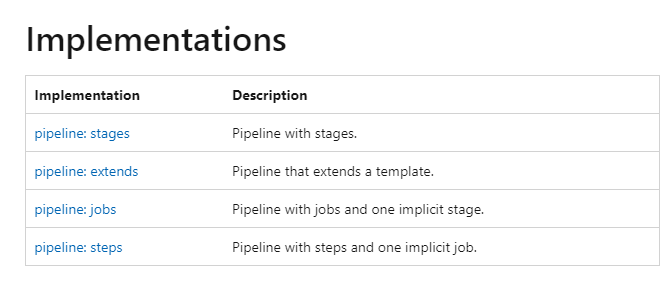
* If we multiple stages then we needs to write jobs and steps multiple
* if in case we dont have multiple stages, means only one stage then not required to write stage, job, directly we can write steps. and the actual work is done at the step level. means perform/implementation.

### Sample of writing azure devops pipelines yaml:

* **_First Version (Stage,job and steps):_**

```yaml
---
pool: default
stages:
- stage: buildpackage
  displayName: build package using maven
  jobs:
  - job: buildpackage
    displayName: build package using maven
    steps:
    - bash: 'mvn package'  
```
* check in repos `azure-pipelines.yaml` we have added the above code and run
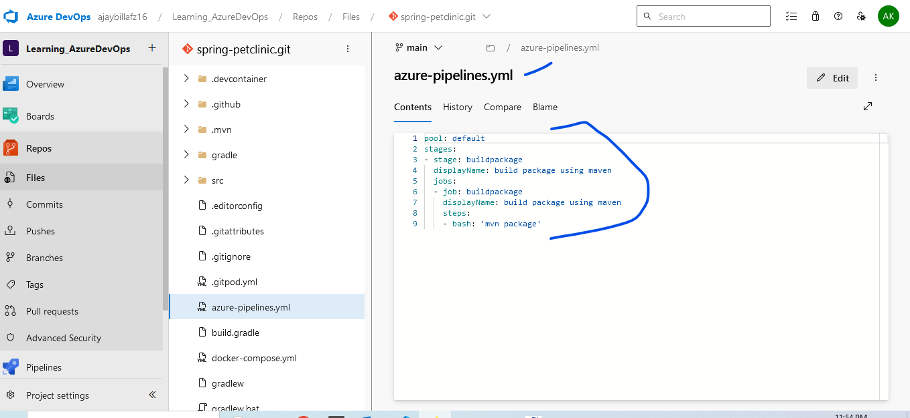

* check the pipeline display name for stage and display name for job, it is our identification we wrote 


* **_Second Version (Job and steps)_**
```yaml
---
pool: default
jobs:
  - job: buildpackage
    displayName: build package using maven
    steps:
    - bash: 'mvn package' 
```
* check in repos `azure-pipelines.yaml` we have added the above code and run

* check the pipeline display name for job, it is our identification we wrote, also in this pipeline there is no stage even though job is running


* **_Third version (steps)_**
```yaml
---
pool: default
steps:
  - bash: 'mvn package'
```
* check in repos `azure-pipelines.yaml` we have added the above code and run
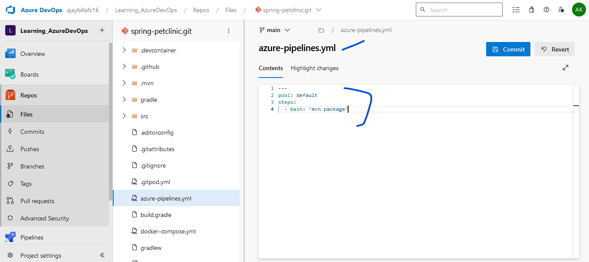
* check the pipeline there is no display name at all,it is our identification we wrote, but here only steps we wrote, also in this pipeline there is no stage and job even though job is running


* Based on situation we decide what should write on above work flow of azure devops pipeline of yaml.

* so based on the above screen shot proof, it proves that if it is only one stage then not required to write stage or job directly we can write steps since, the third version is also worked with spring petclinic
* so now it proves we can write any of these one in `the azure-pipelines.yaml` file 

## Azure DevOps Steps:
* [Refer Here](https://learn.microsoft.com/en-us/azure/devops/pipelines/yaml-schema/steps?view=azure-pipelines) for list of types
### Types of Steps:

* **task:** 
   * reusable build/deploy/utility steps
* **script:** 
   * Runs a script using cmd.exe on Windows and Bash on other platforms.
* **powershell:**
    *  Runs a script in a powershell
* **pwsh:** 
    * Runs a script in a powershell core on Windows, macOS, and Linux.
* **bash:**
    *  Runs a script in Bash on Windows, macOS, and Linux.
* **download:**
   * Downloads artifacts associated with the current run or from another Azure Pipeline that is associated as a pipeline resource.
* **downloadBuild:**
   * Downloads build artifacts.
* **getPackage:**
   * Downloads a package from a package management feed in Azure Artifacts or Azure DevOps Server.
* **publish:**
   * Publishes (uploads) a file or folder as a pipeline artifact that other jobs and pipelines can consume.
* **template:**
   * Define a set of steps in one file and use it multiple times in another file.
* **reviewApp:**
   * Downloads creates a resource dynamically under a deploy phase provider.
* **checkout:**
    * Configure how the pipeline checks out source code

* Azure DevOps allows us to create reusable steps where we fill the yaml and it does the rest. This is done by Task.
* [Refer Here](https://learn.microsoft.com/en-us/azure/devops/pipelines/tasks/reference/?view=azure-pipelines) for task
* If you want to develop a reusable task [Refer Here](https://learn.microsoft.com/en-us/azure/devops/extend/develop/add-build-task?view=azure-devops) 

#### Install Azure Pipelines Extension into Visual Studio Code:
 * Azure Pipelines Microsoft microsoft.com
 

### We started writing simple yaml for maven using task:

```yaml
---
pool: default
steps:
- task: Maven@4
  inputs:
    mavenPomFile: 'pom.xml'
    goals: 'package'
    publishJUnitResults: true
    testResultsFiles: '**/surefire-reports/TEST-*.xml'
    javaHomeOption: Path
    jdkVersionOption: '1.17'
    jdkDirectory: '/usr/lib/jvm/java-17-openjdk-amd64'
    mavenVersionOption: Path
    mavenDirectory: '/usr/share/maven'
```


# Build a dotnet application:
   * Project url NopCommerce:[Refer Here](https://github.com/nopSolutions/nopCommerce)
   * branch: master
   * pre-req’s: in the azure agent:
        * git
        * dotnet 7 sdk [Refer Here](https://learn.microsoft.com/en-us/dotnet/core/install/linux-ubuntu-2204)
```bash
sudo apt-get update && \ 
sudo apt-get install -y dotnet-sdk-7.0
dotnet --list-runtimes
```        
### Manual steps:

```
git clone https://github.com/nopSolutions/nopCommerce.git
cd nopCommerce/
git checkout master
# below command is to build the project release version
dotnet build src/NopCommerce.sln -c Release
# to check the list of test commands
dotnet test --help
# to test the project below command
dotnet test  src/Tests/Nop.Tests/Nop.Tests.csproj -o TestResults  -c Release
# Publishes the application and its dependencies to a folder for deployment to a hosting system
#  The dotnet publish command's output is ready for deployment to a hosting system
dotnet publish src/Presentation/Nop.Web/Nop.Web.csproj -c Release -o published/
```
* check below screen shot for testresult and publish folder


### Dotnet projects: 
  * have two modes of building they are:
     * **Debug:**
        * Debug is to build develop environment 
     * **Release:**
        * Release is for rest of envionment means apart from develop environment
     * this is called as configuration `-c`    

### Command references for dotnet projects:
* **build:** [Refer Here](https://learn.microsoft.com/en-us/dotnet/core/tools/dotnet-build)
* **test:** [Refer Here](https://learn.microsoft.com/en-us/dotnet/core/tools/dotnet-test)
* **publish:** [Refer Here](https://learn.microsoft.com/en-us/dotnet/core/tools/dotnet-publish)

## Azure DevOps Pipeline
