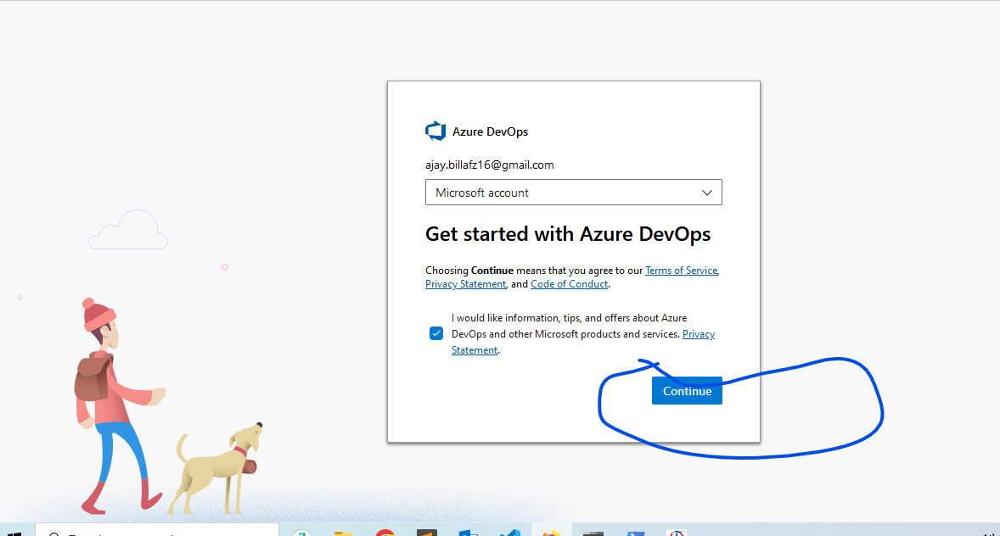
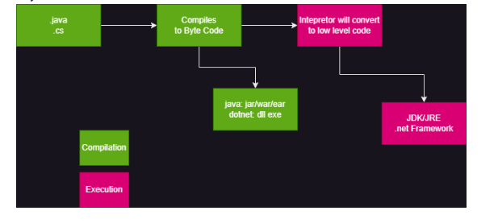

# AzureDevOps:

* Azure DevOps was earlier called as Visual Studio Team Services
* Azure DevOps offers services to
   * manage agile projects
   * test management
   * Pipelines

* **Features of Azure DevOps:**
  * **Management:**
     * Azure Boards
     * Agile Management
  * **Testers:**
     * Test Management
  * **DevOps:**
     * Pipelines
  * **Developer:**
     * Version Control System

* Azure DevOps Features Artitecture:


### Azure DevOps setup:
* **Azure DevOps Server:**
  * We need to install azure devops software on Windows Servers
  * we needs to manage this azure devops software
* **Azure DevOps Services:**
  * This is already hosted by microsoft
  * We have just use by creating account
  * We can create account using
    * GitHub
    * Microsoft Account

### AzureDevOps Plans:

 * Free:
   * 1 Free Microsoft-hosted CI/CD (1800 minutes/month)
   * 1 Free Self-Hosted CI/CD
   * Azure Source Repos => free
   * Azure Artifacts 2 GB

* **Azure DevOps Account Creation Steps:**
  * if you have github account then login with it start free
  * if you have microsoft account or azure cloud account then login with it
  
  
  
  
  
* All Is Well Done Account Creation

### High level overview AzureDevOps:


* **AzureDevOps Services offered:**
  * **Wiki:**
     * we can create all the project related documentation for go through or for new comer to team to have overview of projects
  * **Boards:**
     * Its kind of jira, we track the work and create ticket and assign to team members  
     * Below Options avaiable:
       * product backlog
       * sprint backlogs
       * burn down charts
       * Scrum board  
     * **Azure Repos:**
        * Here manage all the source code/store all the source code of the projects
     * **Azure Pipelines:**
        * This is to manage CI/CD PipeLines and Execute our pipelines of the projects
     * **Azure Test Plans:**
        * Test management i.e. Test cases, executions, defects and reports are managed here
     * **Azure Artifacts:**
        * Here stores all build packages
        * After building the packages during the running of pipeline which will be getting artifacts/war/ear files will be stored here.

### DevOps pipeline High level overview                 
* Why do we need to do Continuous Integrations?
  * We do Continuos integrations multiple times in a day from day 1 of the project so that we can avoid surprises during big bang integrations.
  * Which means to avoid the issues the end of the closure of the project or sprints
* To perform automated integrations we need tools
  * build/package the code
  * run the tests
  * evaluate the test results  

* The idea is perform continuous integration for almost every change submitted by developer(s)
* This practice is recommended to avoid integration failures during later stages of the project
* Big bang integration leads to lot of technical debts.
* Continuous integration ideal workflow:

* The idea of Continuous integration is do give immediate feedback to the developer, about code status.

### Unit Tests:
* This generally represents smaller tests which test functionality at a unit level.
* Developers are responsible for developing unit tests
* With every change done by developer all the unit test needs to be executed and reports should be shown.
* For executing unit tests, each platform has multiple tools like below:
  * java: junit
  * dotnet: mstest, nunit
  * javascript: mocha, jasmine
  * python: pytest

* We need to show the test results with every change.
* here there is some trick with developers because they write unit tests something like below:
  ```py
  assert True == True
  ```
   * so this means this above line in the code says unit test will never fail in entire life, so to over come this issue or from developers tricks we have something called `Code Coverage tools`  
* Code Coverage tools should be included with test runs and code quality reports.
* Some organizations fail the builds based on these results which are often represented as Quality Gates.
* Notify the team via email/slack/teams the results of the build.
* CI pipelines start from source code repositories and end with artifact repository

### Terms:
* **Repository:** 
   * This represents a storage and it also has ability to store versions and history of changes.
* **Source Code Repository:**
   * This repository is used for storing code. This maintains history of every change that is done
   * **Examples:**
      * Git
      * Subversion
      * TFC
      * Perforce
* **Artifact:** 
   * Result of the build package.
* **Artifact Repository or Package Repository:** 
    * This repository is used for storing build packages/artifacts
    * **Examples:**
       * Jfrog/Artficatory
       * Nexus
       * **Docker:**
          * Container registries
     
### Difference between unit test and integration test:
* Unit test: means what developer written the code will test by developer, means test the entire code.
  * For an Example: in shopping cart add or remove the product checking in the order or cart this is known as unit test
* Integration test: means testing on all dependencies of what ever developer wrote the code.
  * For an Example: if a shopping cart the payment has done then order should be completed so there is some communication between payment and order this is known as integration test, how we will write the test from shopping cart we will write dummy order and then try to finish it, we are trying to test two components dependencies. 

### What does it mean to build the code:

* Developers write code using high level languages, but systems understand low level.
* To do this conversions we have three options:
  * **Compiler:**
    * High level to low level before executing the application.
    * Per Operating system we have a different release
  * **Interpreter:**
    * High level to low level during application execution.
    * Releases are same for different os
    * In every os we need to install interpreter
### Hybrid:


Azure DevOps Pipelines:
-----------------------
* Azure DevOps has two ways of building pipelines:
   * Classic Pipelines
   * Azure Pipelines YAML

* **Classic Pipelines:**
   * We rely on user interface(UI)
   * Like jenkins freestyle(UI)
     * **_Drawback:_**
       * History will be missing
     * **_Advantages:_**
       * Easy to start
* **Azure Pipelines YAML:**
   * Pipeline as Code. 
   * We will define pipelines steps in a file `azure-pipelines.yaml` and add it to the version control system (git)
   * Like jenkins pipeline projects and `azure-pipelines.yaml` is like a `(Jenkinsfile)`
     *  **_Advantage:_**
        * History will be maintained
     * **_Disadvantage:_**
         * Learning curve for writing pipeline

* **Azure DevOps has agents:** 
   * Agent is where the build is executed.
   * Like jenkins node
* **There are two types of agents:**   
   * **_Microsoft Hosted agents:_**
      * which azure will create a agent for us and once build is completed it will delete the agent, but we needs to tel azure where is agent.
      * These are machines which will be created on demand by Azure DevOps and will be delete upon build completion.
   * **_Self Hosted Agents:_**
      * These are machines managed by us, we add these machines as agents to Azure DevOps.
      
             