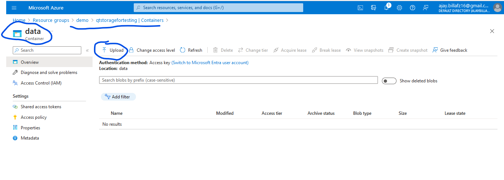
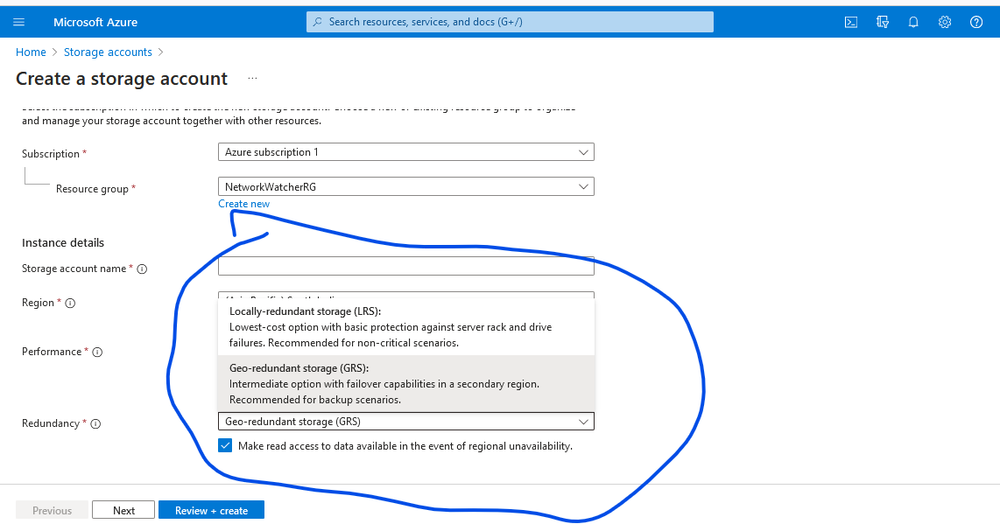
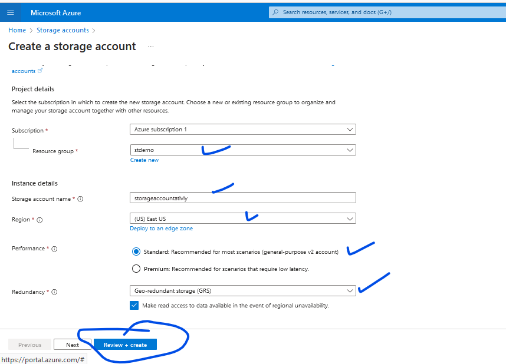
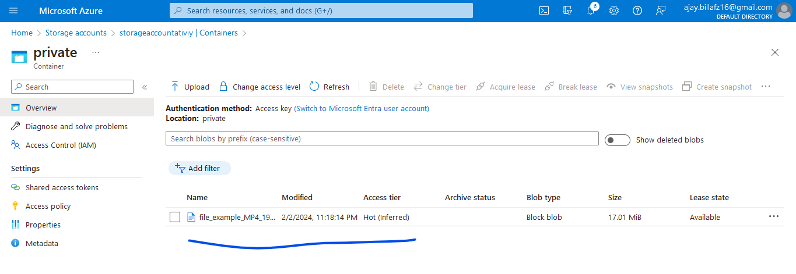
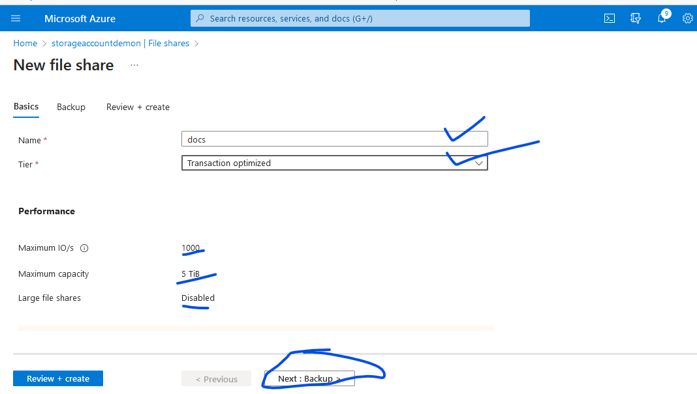
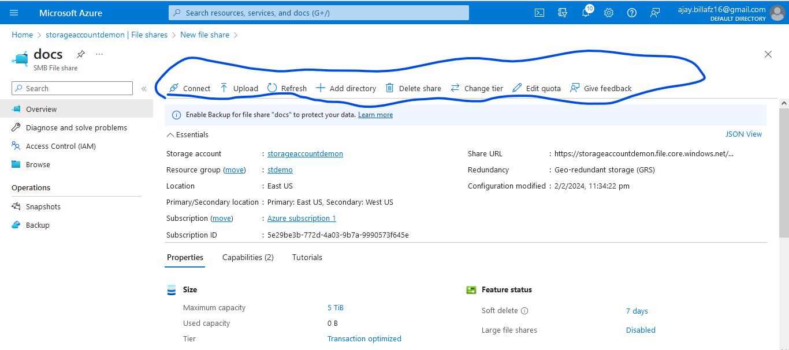
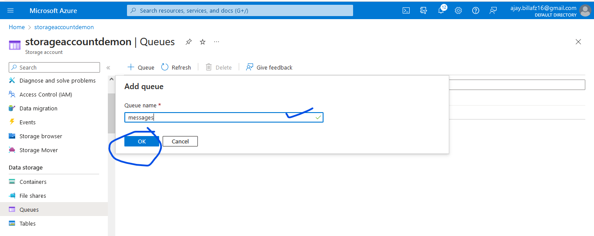
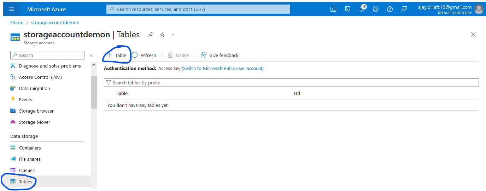

Storage Needs
-------------

### Storage Types By Hardware or Topology:
   * Disk Storage
      * to store data
   * Shared Disk Storage:
      * Network Attached storage
      * Storage Area Networks
          * to use by multiple people common storage
   * Blob Storage (Cloud Storage)

### Storage Types By Usecases
  * Disk
  * Network File Shares/(Shared Disk Storage)
  * Database
  * Data Lakes
  * Backup   

Some important storage concepts
--------------------------------
* **Unit of Storage:**
    * kilobyte vs kibi byte (kb vs kib)
       * 1 kilobytes = 1000 MB
       * 1 kibibytes = 1024 MB

* **Speed of Disk is Measured in two ways:**
   * IOPS (IO per second) 
      * means in per second our hard disk how much data it can read or write
   * Throughput

* **Disk Types:**
   * Magnetic
   * HDD
   * SSD

* **Durability:**
   * what ever you store data or anything what is the lasting capacity/time
* **High Availability:**
   * means data should be accessible all time or not or there is any down time
* **Scalable:**
   * data should be accessible all the time
   * storing the data for storage should always increasing or decrease should be easy and scalable, should say that cannot increase the storage , it is only limited

### Basic Datacenter

### Azure Global infra
* Region has two types
   * Regions
   * Regions with zones
* Edge or Point of Presence location

* Explore Azure infra[Refer Here](https://datacenters.microsoft.com/globe/explore)
   * sky blue points are Regions
   * small full blue are edge or point location
* **Azure Cloud Core Storage Services:**
   * Azure Storage Account
      * Containers:
        * Block Blob (Any file)
        * Page Blob (Virtual disk)
        * Append Blob (Log files)
      * Azure File shares (shared network drives)
      * Azure Table Storage (NoSQL Data)
      * Azure Queue Storage (Message Queue)
   * Azure Managed disk
   * Azure Backup & Azure Site Recovery

### Cloud Terms:
* Service: Whatever azure is offering
* Resource: What we create

Azure Storage Services
------------------------
* [Refer Here](https://learn.microsoft.com/en-us/azure/storage/common/storage-introduction?toc=%2Fazure%2Fstorage%2Fblobs%2Ftoc.json#azure-storage-data-services) official docs
* Azure Provides storage services out of which to deal with the below we need storage account
* what above line means by four below service can be created by using one service in azure called storage account
   * blob storage
   * file share
   * Table storage
   * Queue Storage

Azure Storage Account
----------------------
* Azure Storage account is a service for offering storage services around
  * blobs
  * file shares
  * table storage
  * Queue Storage

* To Store Blobs, We need to create containers. In Each container we can unlimited number of files.
* Each file in Azure Storage account cannot be greater than 4.7 TiB
* Creating a Storage Account:[Refer Here](https://learn.microsoft.com/en-us/azure/storage/common/storage-account-create?tabs=azure-portal) for the docs

* Lets create container to add some data to storage account

* Storage Account name has to be unique across Azure
* url of the storage account/object will be in the following pattern:

`https://qtstoragefortesting.blob.core.windows.net/data/SampleVideo_1280x720_1mb.mp4`

`https://<storageaccountname>.blob.core.windows.net/<container-name>/<filepath>`
* since the storage account and container names are part of urls they need to follow the naming constraints of urls
* Now Lets access the storage account stored object by below url

`https://qtstoragefortesting.blob.core.windows.net/data/SampleVideo_1280x720_1mb.mp4`

SLA’s (Service Level Agreements)
---------------------------------
* Microsoft Azure Gives gurantees to all services in terms of availability
* In Case of storage we have SLA’s around durability as well.

Redundancy in Azure Storage Account
-----------------------------------
* [Refer Here](https://learn.microsoft.com/en-us/azure/storage/common/storage-redundancy) for official docs

* LRS ( Locally Redundant Storage)
   * Any data uploaded will make three synchronous copies in 3 different physical servers
   

* ZRS (Zone Redundant storage)
  * Any data uploded will make three syncronous copies into 3 different zones
  

* RA-GRS (Read only – Geo-Redundant Storage)
   * Create 3 synchoronous in same region as LRS and 3 asynchronous copies in secondary region
   

* Durability and Availability options
    * [Refer Here](https://learn.microsoft.com/en-us/azure/storage/common/storage-redundancy#durability-and-availability-parameters) for official docs 

* RA – GZRS

### Storage Account Creation Options w.r.t Redundancy
* Region with Zones

* Regions without Zones

Access Tier in Storage Account
-------------------------------
* [Refer Here](https://learn.microsoft.com/en-us/azure/storage/blobs/access-tiers-overview) for official docs
* **Hot:** This is default access tier and is used for frequently accessed data.
     * Storage cost is highest
     * Access Cost is cheapest
* **Cool:** This is access tier which is used for infrequently accessed data.
    * Storage cost is moderate
    * Access cost is more
* **Cold Tier:** This is access tier which is used for infrequently accessed data. This data has to be at least 90 days old
   * Storage cost is less than cool
   * Access cost is more
* **Archive Tier:**
   * Storage cost is cheapest
   * No access.
   * If you want to access convert the access tier of the file to hot or cool.
   * Rehydrating the Access tier [Refer Here](https://learn.microsoft.com/en-us/azure/storage/blobs/archive-rehydrate-to-online-tier?tabs=azure-portal)
     * By changing its tier from archive to hot or cool with the Set Blob Tier operation. 
     * By copying it to a new blob in the hot or cool tier with the Copy Blob operation.
* [Refer Here](https://azure.microsoft.com/en-us/pricing/calculator/) for pricing calculator

Reservations in Azure
----------------------
* [Refer Here](https://azure.microsoft.com/en-in/pricing/reservations/) for Azure reservations where azure offers more discount if we give a commitment for 1 year or 3 years

Storage Account
----------------
* Different Types of Data that can be stored in Azure Storage account
  * Block Blob => Any file less than 4.7 TiB
  * Page Blob => Virtual Hard disk
  * Append Blob => Log files
  * Table Storage => NoSQL Data
  * File Share => Network Disk
  * Queue Storage => Message Queue

* Types of storage accounts[Refer Here](https://learn.microsoft.com/en-us/azure/storage/common/storage-account-overview#types-of-storage-accounts)
* Premium Blob storage [Refer Here](https://learn.microsoft.com/en-us/azure/storage/blobs/storage-blob-block-blob-premium)
* Azure Storage Account created will not be part of virtual network
* Any data in storage account is accessed over https using internet which can be restricted.

### Activity 1: create a basic storage account
* Create a storage account with standard, any redundancy other than LRS
* Create two **containers:**
   * shared (Anonymous access blob/container)
   * private (private access)
* Upload any files into above created container preferably `(.txt,.pdf,.mp3,.png,.mp4)`

#### Solution:
* Created a resource group in east us

* Create a storage account

* create public container called `shared`

* created private container called `private`

* upload files to public container

* Now access the object/content of public container

`https://storageaccountativiy.blob.core.windows.net/shared/SampleVideo_1280x720_2mb.mp4`
* it public container able to access

* Upload files to private container

* Now access the object/content of private container

`https://storageaccountativiy.blob.core.windows.net/private/file_example_MP4_1920_18MG.mp4`
* Error message when trying to access private container blob

### Activity 2: Create other storage types

* **File Shares:**

* **Queue Storage:**

* **Table Storage:**

