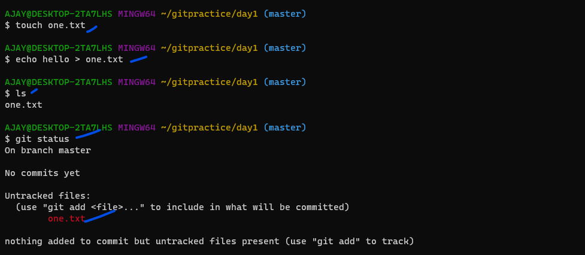

Version Control Systems
-----------------------

* This is source code repository
* Software which allows us to store code along with history is called as Version Control Systems.
* **Evolution of VCS or Types:**
   * Single System VCS
   * Client Server VCS: 
      * Popular examples are Subversion, Clear Case, Visual Source Safe etc:
        * Online
        * Offline
* **Distribute Version Control Systems:** 
   * Mercurial
   * Git

Git
---

* In Git we have 5 areas
   * Working tree/Working Area
   * Staging area/Cache area/Index Area
   * Local repository/Commit Area
   * Remote Repository
   * Stash

* Lets focus on 3 areas:

### Note:
* Command lines:
   * Cheat sheet 
     * [Refer Here](https://education.github.com/git-cheat-sheet-education.pdf)
     * [Refer Here](https://www.atlassian.com/git/tutorials/atlassian-git-cheatsheet)

* Create a local repository
* create an empty directory and execute `git init`     

* Configure username and email id `one time job`

* Create one file `one.txt` and execute `git status`

* Three areas quick revision

* Lets add this change to the staging area

* Lets create a commit with this one change

* For every commit git gives commit id with username, email, message and date time information

* Create a new file `two.txt` and change the contents of `one.txt`

* untracked files represent the files newly created in working tree which donot have any history in local repo and for the files which are already existing in local repo we see states such as
  * modified
  * renamed
  * deleted

* Lets add both the changes to staging area

