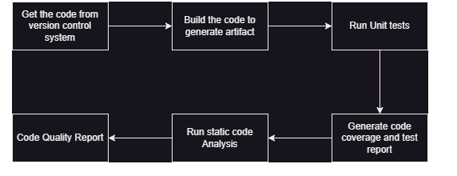

# Continuous Integration and Continuous Delivery/Deployment

* Jenkins is like crontab because jenkins will integrate with other tools or what ever we say jenkins it will do and it will call the other tool.
* it is just like crontab, jenkins will not do any work nor it dosent know anything, just it will call other tools to do the work thats it. 
* jenkins can do anything and everything, that we can do in commandline 
* jenkins never does the work
* jenkins will calls the command which does the work

---

## Continuous Integration Means

* when ever developer will commit the code to any remote/centralize repository it wil start testing and checking quality of the code and deploy to lower environment

## Continuous Delivery/Deployment
where ever developer will commit the code to any remote/centralize repository it will start testing with lower environment and deploy to production 

## Jenkins Default Home Directory
* /var/lib/Jenkins
* where all our projects/jobs related information will contain

## Adding jenkins user to No Passwd Authentication

* this below editor is NaNo 
* Switch to root
       
    * sudo su - 
    * visudo
* go=>to=>  
`Allow members of group sudo to execute any command`
* Add this below line to above member group
    
  * jenkins ALL=(ALL:ALL) NOPASSWD:ALL
* Save changes visudo file    
   
   * Control O
   * Enter
   * Control X

## Adding jenkins user to No Passwd Authentication

* this below editor is VI
* Switch to root
       
    * sudo su - 
    * vi sudoers
* go=>to=>     
`Allow members of group sudo to execute any command`
* Add this below line to above member group
    
  * jenkins ALL=(ALL:ALL) NOPASSWD:ALL
  * Save changes sudoers file
  * :wq!

### what is plugin
* Plugin will add functionality to jenkins not to our system/instance, even if we install plugin in jenkins just we can use that functionality or option of that plugin but we have to install same plugin like software in the instance then only jenkins will call that tool if not no. 

### Workspace

* /var/lib/jenkins/workspace/, is a folder in our instance where all our project or jobs will execute
* where it will generate the artifact means war.file or jar. file

### Jobs

* is a folder where all our projects/jobs nextBuildNumber, build history, config.xml file will generate

### Dummy Repos which can use for practice purpose

* https://github.com/spring-projects/spring-petclinic.git

### Complier
* complier is a tool which translate from one launguage to another.
* once compliation is done dont need a complier  

### Interpreter 
* interpreter belongs to example of translator we need always till the translation is taken place

### Jar contain byte code, it executes by its own

### War contain byte code, and it required some webserver or application server to work 

### .net contain dll/exe means interpretor 

## Dependencies

* Whenever a software project is developed, they have lot of dependencies
* before building the code in the local instance or in jenkins, dependencies have to be present locally and that plugin should be installed in jenkins under manage jenkins so that we can use that fancy UI of that software and work.
* if locally that software is not present means we cannot build the code, we will get error saying command not found 

### To manage these dependencies, every programming language has some kind of package manager 

* Follow Below
  ------------
* dotnet: nuget is the package manager
  * In case of dotnet Dependencies contain in these files or formate packages.config/packages.json

* java: maven can handle package management

   * In case of java Dependencies contain in these files or formate Pom.xml

* python: pip is the package manager

   * In case of python Dependencies contain in these files or formate requirements.txt 

* nodejs: npm can handle package management

  * In case of nodejs Dependencies contain in these files or formate package.json 

## Jenkins Terms Needs to Understand

* Artifact : 
  -----------
* Artifact means after we build the code we get war/jar file that is known as artifact
* the result of our code is known as artifact
* To generate the artifact we will use MSbuild for 
.net applications
* To generate the artifact we will use maven/gradle for java applications

* Unit Test :
  ------------
* In Java Junit is test case will test the code after build
* In Microsoft mstest/nunit  is test case will test the code after build
* In Python  pytest is test case will test the code after build
* In Nodejs jasmine mocha is test case will test the code after build
* what ever tools we want we can run but at the end of the day most of CI/CD system understand to generate the JUnit xml file reports as a test result 

* Code Coverage :
  ----------------
* We will use sonar qube to code analysis and check the quality of code and bugs 

* Static Code Analysis :
  -----------------------
* We will use sonar qube 

* Artifact Repository :
  ----------------------
* We will use Jfrog
* Azure artifact

## Build Code Work Flow

