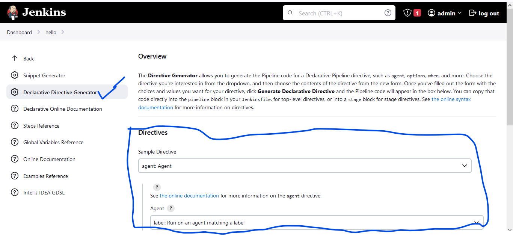
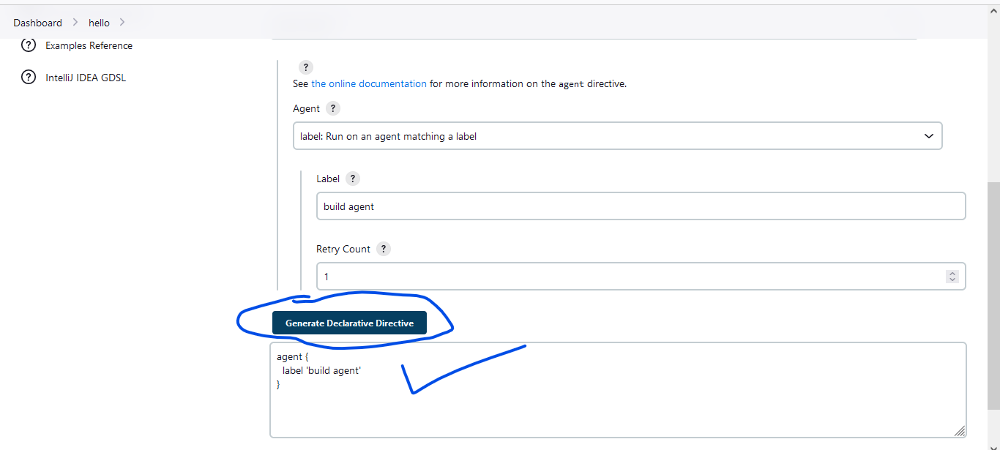
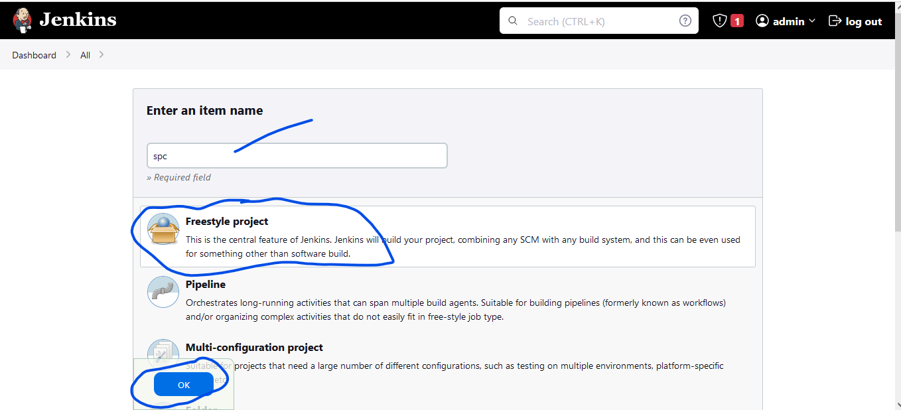
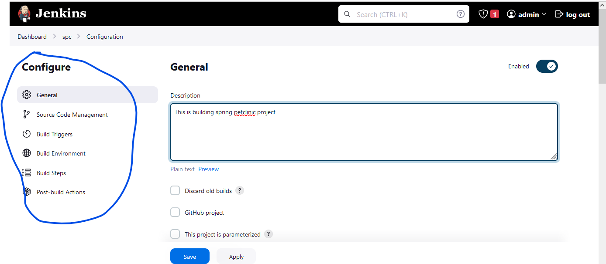
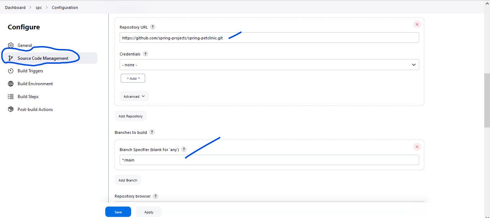
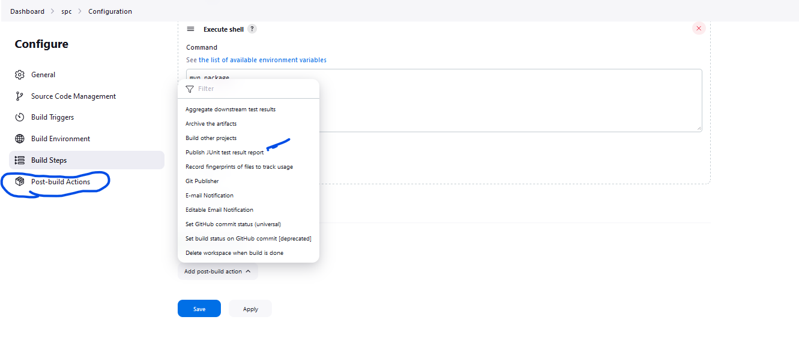
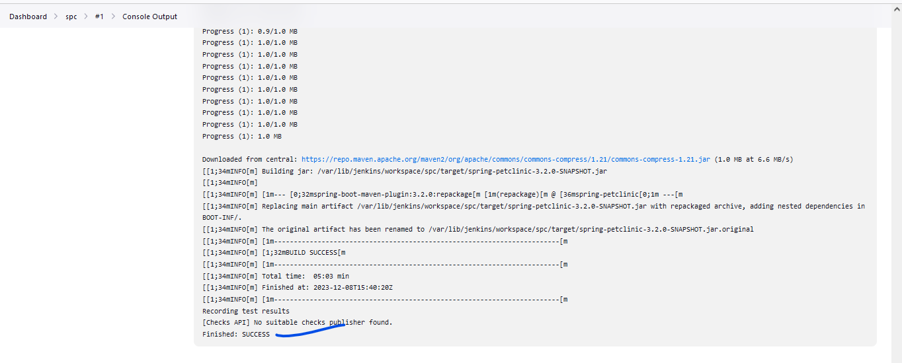
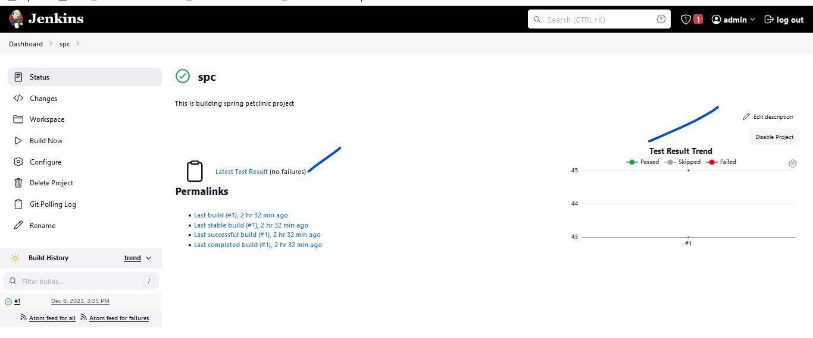
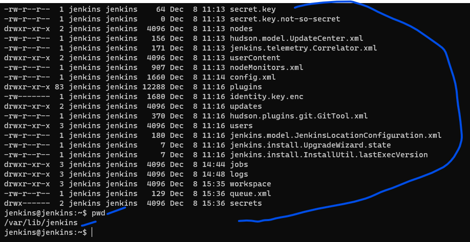
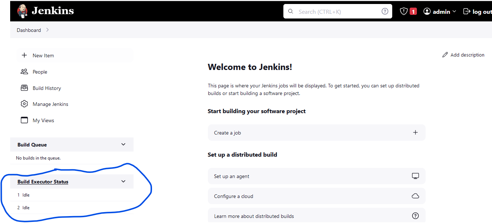

# Continuous Integration and Continuous Delivery/Deployment

* Jenkins is like crontab because jenkins will integrate with other tools or what ever we say jenkins it will do and it will call the other tool.
* it is just like crontab, jenkins will not do any work nor it doesn't know anything, just it will call other tools to do the work thats it. 
* jenkins can do anything and everything, that we can do in commandline 
* jenkins never does the work
* jenkins will calls the command which does the work

---

### Continuous Integration:

* when ever developer will commit the code to any remote/centralize repository it wil start testing and checking quality of the code and deploy to lower environment
* the moment developer submit the code we will build the package and do some small  testcase/run performance test
is known as continues integration 
* chain => VCS submit the code => build package => unittest.

### Continuous Delivery:
* the moment developer submit the code and we will build the package and do unittesting, security testing and performance testing, and deploy to the up to pre-prod/UAT environment is known as continues delivery   
* chain => VCS submit the code => build package => unittesting => ST env => PT env => pre-prod/UAT env
* where ever developer will commit the code to any remote/centralize repository it will start testing with lower environment is known as continues delivery   

### Continuous Deployment:
* where ever developer will commit the code to any remote/centralize repository it will start testing with lower environment and deploy to production 
* the moment developer submit the code and we will build the package and do some unittesting, security testing and performance testing, and deploy to the up to prod/live environment is known as continues deployment
* chain => VCS submit the code => build package => ST env => PT env => UAT env => prod/Live environment


### Jenkins Default Home Directory
* /var/lib/Jenkins
* where all our projects/jobs related information will contain

### Adding jenkins user to No Passwd Authentication
#### Ubuntu: 
* this below editor is NaNo 
* Switch to root
       
    * sudo su - 
    * visudo
* go=>to=>  
`Allow members of group sudo to execute any command`
* Add this below line to above member group
    
  * jenkins ALL=(ALL:ALL) NOPASSWD:ALL
* Save changes visudo file    
   
   * Control O
   * Enter
   * Control X

### Adding jenkins user to No Passwd Authentication
#### Linux
* this below editor is VI
* Switch to root
       
    * sudo su - 
    * vi sudoers
* go=>to=>     
`Allow members of group sudo to execute any command`
* Add this below line to above member group
    
  * jenkins ALL=(ALL:ALL) NOPASSWD:ALL
  * Save changes sudoers file
  * :wq!

### what is plugin
* Plugin will add functionality to jenkins not to our system/instance, even if we install plugin in jenkins just we can use that functionality or option of that plugin but we have to install same plugin like software in the instance then only jenkins will call that tool if not no. 

### Workspace

* /var/lib/jenkins/workspace/, is a folder in our instance where all our project or jobs will execute
* where it will generate the artifact means war.file or jar. file

### Jobs

* is a folder where all our projects/jobs nextBuildNumber, build history, config.xml file will generate

### Dummy Repos which can use for practice purpose

* https://github.com/spring-projects/spring-petclinic.git


### Complier
* complier is a tool which translate from one launguage to another.
* once compliation is done dont need a complier  

### Interpreter 
* interpreter belongs to example of translator we need always till the translation is taken place

### Jar contain byte code, it executes by its own

### War contain byte code, and it required some webserver or application server to work 

### .net contain dll/exe means interpretor 


### Dependencies

* Whenever a software project is developed, they have lot of dependencies
* before building the code in the local instance or in jenkins, dependencies have to be present locally and that plugin should be installed in jenkins under manage jenkins so that we can use that fancy UI of that software and work.
* if locally that software is not present means we cannot build the code, we will get error saying command not found 

### To manage these dependencies, every programming language has some kind of package manager 

Follow Below:
------------
* dotnet: nuget is the package manager
  * In case of dotnet Dependencies contain in these files or formate packages.config/packages.json

* java: maven can handle package management

   * In case of java Dependencies contain in these files or formate Pom.xml

* python: pip is the package manager

   * In case of python Dependencies contain in these files or formate requirements.txt 

* nodejs: npm can handle package management

  * In case of nodejs Dependencies contain in these files or formate package.json 

Jenkins Terms Needs to Understand
----------------------------------

### Artifact:
* Artifact means after we build the code we get war/jar file that is known as artifact
* the result of our code is known as artifact
* To generate the artifact we will use MSbuild for 
.net applications
* To generate the artifact we will use maven/gradle for java applications

### Unit Test:
* In Java Junit is test case will test the code after build
* In Microsoft mstest/nunit  is test case will test the code after build
* In Python  pytest is test case will test the code after build
* In Nodejs jasmine mocha is test case will test the code after build
* what ever tools we want we can run but at the end of the day most of CI/CD system understand to generate the JUnit xml file reports as a test result 

### Code Coverage:
* We will use sonar qube to code analysis and check the quality of code and bugs 

### Static Code Analysis:
* We will use sonar qube 

### Artifact Repository:
* We will use Jfrog
* Azure artifact

### Build Code Work Flow:


To script Generate Pipeline Syntax
----------------------------
### Steps:
* When creating pipeline project=> click on `Pipeline Syntax` 

* New Tab will be opened called `Generate Declarative Directive`




Using Jenkins to build Maven Projects
--------------------------------------
### Required software:
* **Jenkins configuration in Master Node:**
   * Install jenkins
   * jdk 17
* Adding jenkins user to sudoers Group:
  * why we are adding jenkins user to sudoers is because wile executing pipeline jenkins should not ask for password or authentication 
#### Steps For Ubuntu:
```bash
sudo visudo
# give permission to jenkins user without password
jenkins ALL=(ALL:ALL) NOPASSWD:ALL
# save the changes in the editor
CTRL + O
CTRL + X 
```
* Install and configure maven in Jenkins
  * means needs to switch to jenkins user then install maven
```bash
sudo su -
su - jenkins
sudo apt install maven -y 
mvn --version
```  

* Lets build spring petclinic [Refer Here](https://github.com/spring-projects/spring-petclinic)
  * software requirements To build spring petclinic: 
    * jdk 17
    * maven
* Create a free style project to build spring petclinic


* Free style project sections

* General: This represents the project information

* Source Code Managent: This represent the code to be used for ci/cd pipelines

* Build Triggers: This represent when to build the project
  * Build Periodically: If the project has to be build based on schedule, write cron expression into this, but here if there is a change in git or not it will build because we have mentioned cron expression to build at that particular period. 
  * Poll SCM: this represents jenkins polling scm (asking git is there any changes that i should build it) and the cron expression represents how frequently poll scm should ask git for it. for example if any new commit id is there then only it will build if not, it will not build. 

* Build Environment: This represents the environmental configuration

* Build Steps: These are actual activities that are performed during execution.


* Post Build actions: Actions to be performed after completion of build


* To trigger build manually

* Jenkins build got success

* Test results



### Where Jenkins executes all its project and how jenkins works:
* Under Jenkins Home `var/lib/jenkins` it executes all the project information

* Under `Jobs` it executes projects


* In `config.xml`
  * it will contain all the steps which we written in jenkins UI or all the build steps even if code formate
* In `nextBuildNumber`
  * it will contain what is the next build number when we execute the job
* Under ` builds`
   * permalinks: contain build status
* Under `workspace`
  * Git url will clone in this directory called `workspace` and  our project will execute and generate artifact


### Jenkins Terms
* **Jenkins home:**
   * Jenkins home is a folder where jenkins stores all of is configuration. In the above case the workspace is `/var/lib/jenkins`. If you want to change the workspace deal with `JENKINS_HOME` by setting the environment variable we can chagne the default `Jenkins Home`
* **Backup of Jenkins:**
    * is to take backup of `Workspace` that is `/var/lib/jenkins`    
* **Project:**
   * This contains the actvity that needs to be performed on triggers.
     * This project is stored as xml file in workspace
     * Types Of Project:
        * Freestyle project: This is UI based configuration
        * Pipeline: This is instructions expressed in some code format that is jenkins file.
* **Build:** 
   * This represents the execution of project. Every build for a project has a running number called as `Build id` or `Build Number`

* **Node:**
   * This represents the machine on which build can be executed.
   * Each Node can be configured to handle multiple builds by executors.
     * On Jenkins UI as per below screen shot we can see how many executors are there. based on that so many executors can execute the project on jenkins, so we have two executors so that we can build two different projects, not same two project, if same tow project builds is called concurrent builds.
     * Eventually we can change the executors also if required.
     


        


   


