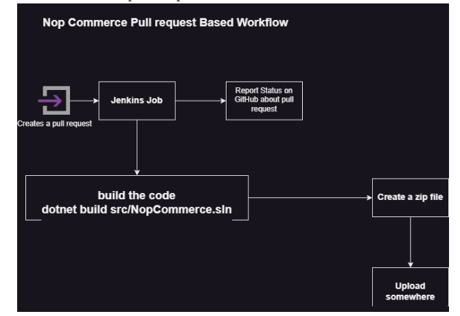
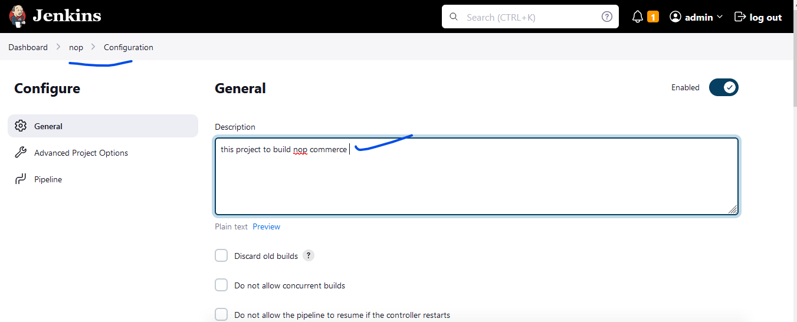
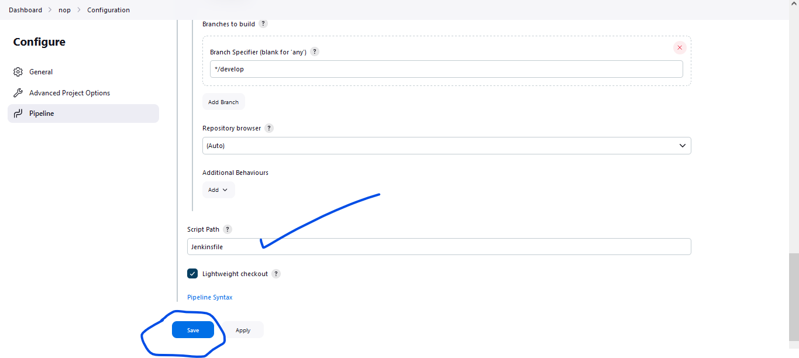

Workshop – Project - Assumption
------------------
* Its a predefined, means just an assumption how we are going to do the workshop, just setting up predefined all the steps.

* Project which will be doing in workshop [Refer Here](https://github.com/nopSolutions/nopCommerce)
* We will create a pull request based on workflow


#### Two Types of workflow:
* In Release Branch (Night build)
* will be doing two workflow
  * Docker/Container based workflow: 
     * In Terraform we will be doing following workflow is (DevSecOps)
     * here when ever developer pushes the code build the code and package over here is `docker image`
     * we will also discuss about 
        * Security Scans
           * SCA
           * SAST
           * DAST
     * After doing scan we will be using terraform to  create 
        * Kubernetes cluster and Deploy application into it.      
* Another workflow is:
   * VM based Workflow
     * From Terraform we will create below resources may be aws/azure and will be deploying nop commerce application into VM. 
       * VM
       * Database

---

Actual Workshop Steps:
----------------------
* CI/CD Pipeline Based on Jenkins

### Virtual Machine or Cloud Based Deployment
 * We will be building a CI/CD Pipeline of a .net platform based application

### Steps:
   1. Jenkins Master and Node setup with OS Ubuntu
      * Jenkins Master
         * software requirements:
            * openjdk-17
            * jenkins
      * Node:      
         * software requirements:
            * openjdk-17
            * .net 7 sdk
            * git
            * zip 
   2. Build steps: Manual
   ```bash
   git clone https://github.com/dummyreposito/nopCommerceJuly23.git
   dotnet restore src/NopCommerce.sln
   dotnet build -c Release src/NopCommerce.sln
   dotnet publish -c Release src/Presentation/Nop.Web/Nop.Web.csproj -o publish
   mkdir publish/bin publish/logs
   zip -r nopCommerce.zip publish
   ```            
### Jenkins file
* To build the NopCommerce and zip the file created jenkinsfile

```Jenkinsfile
pipeline {
    agent any
    stages {
        stage('vcs') {
            steps {
                git branch: 'develop', 
                    url: 'https://github.com/dummyreposito/nopCommerce-july23.git'    
            } 

        }
        stage('package') {
            steps {
                sh 'dotnet restore src/NopCommerce.sln'
                sh 'dotnet build -c Release src/NopCommerce.sln'
                sh 'dotnet publish -c Release src/Presentation/Nop.Web/Nop.Web.csproj -o publish'
                sh 'mkdir publish/bin publish/logs && zip -r nopCommerce.zip publish'
                archive '**/nopCommerce.zip'
            }

        }
    }
}
``` 

```
git add .
git commit -m .
git push origin develop
```
* Lets Build NOPCommerce for above steps:




* Build Result Success


### Container Based Deployment:
#### Steps:
   1. Jenkins Master and Node setup with OS Ubuntu
       * Jenkins Master
         * software requirements:
            * openjdk-17
            * jenkins
      * Node:      
         * software requirements:
            * openjdk-17
            * git
            * zip 
            * Docker

   2. build steps: Manual
   ```
   git clone https://github.com/CICDProjects/nopCommerceJuly23.git
   # replace latest with Git Commit id or build id
   docker image build -t nopCommerce:latest .
   docker image tag nopCommmerce:latest ajaykumarramesh/nopCommerce:latest
   docker image push ajaykumarramesh/nopCommerce:latest
   ```
   1. Write Jenkinsfile for the above steps
   
     
    


