# RBAC In Kubernetes:

### Authorization in K8s:

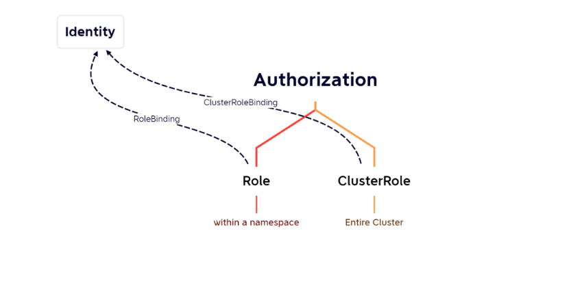
* [Refer Here](https://kubernetes.io/docs/reference/access-authn-authz/rbac/)


### Authentication in k8s:


* [Refer](https://kubernetes.io/docs/reference/access-authn-authz/authentication/)

* [Refer Here](https://kubernetes.io/docs/reference/access-authn-authz/certificate-signing-requests/#normal-user) to create csr,ca.crt 

* Attaching Authorization to identity using Bindings
  * RoleBinding
  * ClusterRoleBinding

### For RBAC we need to understand Role and RoleBindings:

* Rules in ClusterRole or Role are inclusive i.e. they support only allow rules(there is are no "deny" rules).
* Role and RoleBindings apply to a particular namespace
* For a cluster wide definition, k8s offers
   * ClusterRole
   * ClusterRoleBinding

### Definitions:

* **Role:**
   * A Role contains rules that represent a set of permissions
   * A Role always sets permissions within a particular namespace
   * a role cannot access resources from other namespaces
   * a role cannot access cluster scoped resources
   * in case if we use role then each and every time in every namespace we needs to create role and bond with rolebinding so alternate to this is `clusterrole`

* **RoleBinding:**
  * A role binding grants the permissions defined in a role to a user or set of users.
  * It holds a list of subjects (users, groups, or service accounts) and a reference to the role being granted. 
  * A RoleBinding grants permissions within a specific namespace
  * A RoleBinding may reference any Role in the same namespace.
  * a RoleBinding can reference a ClusterRole and it can bind that clusterRole to the namespace of the RoleBinding. 
  * A RoleBinding can also reference a ClusterRole to grant the permissions defined in that ClusterRole to resources inside the RoleBinding's namespace.
  *  If you want to bind a ClusterRole to all the namespaces in your cluster, you use a ClusterRoleBinding.

* **ClusterRole:**
   * A ClusterRoles contains rules that represent a set of permissions
   * A ClusterRoles always sets permissions to entire cluster
   * so for above role definition, instead of creating each role for every namespace level every time its not good idea so for that we are or we can use clusterrole at cluster level, only one cluster role we can create with common permissions for all the users and we can bond with rolebinding so that only one cluster role will work for all the namespaces.
   * but since we are bonding with rolebinding so that rolebinding works only at namespace level so we can access rosources form that rolebinding namespaces. not other namespaces. 
   * in case if we want to access other namespaces with one cluster role and also access cluster resources then cluster role needs bond with clusterrolebinding. 
* **ClusterRoles have several use case. You can use a ClusterRole to:**
   * define permissions on namespaced resources and be granted access within individual namespace(s)
   * define permissions on namespaced resources and be granted access across all namespaces
   * define permissions on cluster-scoped resources      
* If you want to define a role within a namespace, use a Role; if you want to define a role cluster-wide, use a ClusterRole.
* A ClusterRole can be used to grant the same permissions as a Role. Because ClusterRoles are cluster-scoped, you can also use them to grant access to:
  * cluster-scoped resources (like nodes)
  * all types of cluster resources like.
  * non-resource endpoints `(like /healthz)`
  * namespaced resources (like Pods), across all namespaces
  * For example: you can use a ClusterRole to allow a particular user to run `kubectl get pods --all-namespaces` but this happens only when we bond with clusterrolebinding, not with rolebinding
  * ClusterRole that can be used to grant read access to secrets in any particular namespace, or across all namespaces
  * these all depending on how it is bound.
  * cluster role if bonds with clusterrolebinding then what ever above said is possible
  * if cluster role is bond with rolebinding then only limited above said is possible, we will see this difference in experiment.

* **ClusterRoleBinding:**
   * ClusterRoleBinding grants that access cluster-wide/entire cluster
   * If you want to bind a ClusterRole to all the namespaces in your cluster, you can use a ClusterRoleBinding.
   * To grant permissions across a whole cluster, including cluster resources also. you can use a ClusterRoleBinding.

## Role Based Access control (RBAC):
* In k8s you need to be authenticated before you are allowed to make a request to an API Resource.
* A cluster administrator has access to all resources and operations and is easiest way to operate with admin account, but sharing it with everyone poses/getting security risk `admin access for everyone`
* RBAC defines policies for users, groups and processes by allowing and disallowing access to manage API resources, like pods,deployment,secrets. etc.
* **RBAC helps in implementing use-cases such as:**
  * Establishing a system for users with different roles to access set of k8s resources/objects
  * Controlling process running in a Pod and Operations they can perform via k8s api
  * Limiting visibility of certain resources in namespaces

### Building Blocks:
* Three building blocks of k8s RBAC:


* **Subject:** 
   * The user or process that wants to access a API
* **Resource/Objects:**
   * API Resource/Objects: The k8s API Resource (eg Pod, Deployment, StatefulSet, etc..)
* **Verb/Operation:** 
    * The Operation that can be performed on a resource like eg (get,view,delete and create)

### Please Note: 
* [Refer Here](https://kubernetes.io/docs/reference/access-authn-authz/authorization/) for kubectl auth can -i 
* `kubectl auth can-i` helps in finding whether you have access on resource to perform some operation or not like below eg:-

    `kubectl auth can-i create deployments --namespace dev`

* The output is similar to this:

    `yes`

`kubectl auth can-i create deployments --namespace prod`

* The output is similar to this:

    `no`


### Authentication strategies:
* X.509 client certificate (openssl certificates)
* Basic authentication (username and password)
* Bearer tokens (OpenId)

#### For Activity refer this below link for guide on RBAC:
  * [Refer Here](https://www.adaltas.com/en/2019/08/07/users-rbac-kubernetes/)


## Activity:

* Login into k8s control plane node and create a temporary directory to store keys
```
mkdir cert 
cd cert
```
* Now create a private key for user muthu

`openssl genrsa -out muthu.key 2048`


* Create a CSR

`openssl req -new -key muthu.key -out muthu.csr -subj "/CN=muthu/O=learning"`


* Sign the CSR with k8s cluster certificate authortity which is usually found in directory /etc/kubernetes/pki and we need two files ca.crt & ca.key

`openssl x509 -req -in muthu.csr -CA /etc/kubernetes/pki/ca.crt -CAkey /etc/kubernetes/pki/ca.key -CAcreateserial -out muthu.crt -days 180`


* As a cluster admin, create a user in k8s by setting user entry kubeconfig for muthu and point to the cr and key file.

`kubectl config set-credentials muthu --client-certificate=muthu.crt --client-key=muthu.key`


* Create a context for the user

`kubectl config set-context muthu-context --cluster=kubernetes --user=muthu`


* to get show the context

`kubectl config get-contexts`


* We can switch context

`kubectl config use-context muthu-context`


* So here user muthu has given authentication so we can login or switch muthu user but still muthu unable to access any api resource because we have not given still authorization to muthu

#### Lets create two namespace:
 * develop
 * prod
 ```
 # prod
 ---
apiVersion: v1
kind: Namespace
metadata:
  name: prod
# develop
---
apiVersion: v1
kind: Namespace
metadata:
  name: develop  
```


### Lets create Role for user muthu

```
---
apiVersion: rbac.authorization.k8s.io/v1
kind: Role
metadata:
  name: muthu-role
  labels:
    namespace: develop
rules:
- apiGroups: ["*"]
  resources: ["deployments","service","pods","configmap"]
  verbs: ["get","list","delete","update"]
```
* apply muthu role
```
kubectl apply -f muthu-role.yaml
kubectl get role
kubectl get role.rbac.authorization.k8s.io
```


### Lets create RoleBinding for user muthu

```
---
apiVersion: rbac.authorization.k8s.io/v1
kind: RoleBinding
metadata:
  name: muthu-rolebinding
  labels:
    namespace: develop
subjects:
- apiGroup: rbac.authorization.k8s.io
  kind: User
  name: muthu 
  namespace: develop
roleRef:
  apiGroup: rbac.authorization.k8s.io
  kind: Role  
  name: muthu-role
```
* Apply muthu rolebinding

```
kubectl apply -f muthu-rolebinding.yaml
kubectl get rolebinding
```


### Now Lets bond the user muthu role with rolebinding:
### Now Lets do the experiment on above user muthu:
* we have created role and RoleBinding for user muthu
* so from our admin context needs to switch which ever namespace we want to do experiment then should create the role and RoleBinding
* in this experiment i set context as kubernetes-admin@kubernetes to develop namespace then i created role and RoleBinding for muthu
* after creation i have switch context to user muthu and switch to namespace also develop then now ill start my experiment
* observe below screen shots as i describe i can get all resource


* user muthu cant get resources from prod namespace observe output because role and RoleBinding is set permission only for particular namespace that is develop


* user muthu can delete the resources since got access for deleting to in verb

* user muthu can create the resource since have permission in verb to create.

   ` kubectl run nginx --image=nginx`

* user muthu cannot get/access cluster resources because user muthu defined only role with rolebinding so that is for only particular namespace for only api resources not cluster resources


### Now Lets do the experiment on above user muthu with cluster role and bond with rolebinding:
* we can use clusterrole with rolebinding bond because instead of created reach role for different user, in this experiement we are going to create only one cluster role for two users that is muthu and bala.
* with these two users we adopt the clusterrole bond with rolebinding
* we have created tow users.
  * muthu
  * bala
  * to create users steps are same as shown in the above while creating role with rolebinding.

```
openssl genrsa -out bala.key 2048
openssl req -new -key bala.key -out bala.csr -subj "/CN=bala/O=practice"
sudo openssl x509 -req -in bala.csr -CA /etc/kubernetes/pki/ca.crt -CAkey /etc/kubernetes/pki/ca.key -CAcreateserial
 -out bala.crt -days 180
 kubectl config set-credentials bala --client-certificate=bala.crt --client-key=bala.key
 kubectl config set-context bala-context --cluster=kubernetes --user=bala  
 kubectl config use-context bala-context
```
* Creating two namespaces

```
kubectl create namespace develop
kubectl create namespace prod
kubectl get ns
```


* **Lets create a common clusterrole for users muthu:**

```
apiVersion: rbac.authorization.k8s.io/v1
kind: ClusterRole
metadata:
  name: users-namespaces-level
rules:
- apiGroups: ["*"]
  resources: ["deployments","services","pods","configmaps","replicaset"]
  verbs: ["get","list","delete","update","create", "watch"]
```

```
# i am applying all the roles from my admin kubernetes
# while applying clusterrole we can default admin namespace because its cluster scope no issues
vi clusterrole-users.yaml
kubectl apply -f clusterrole-users.yaml
kubectl get clusterrole
```
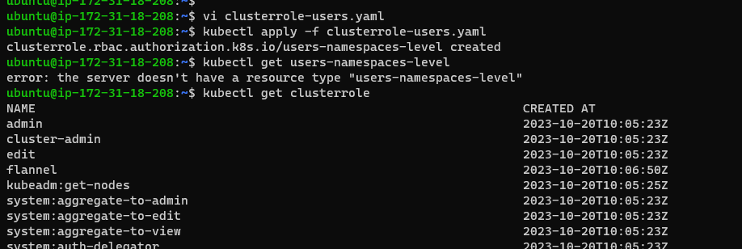
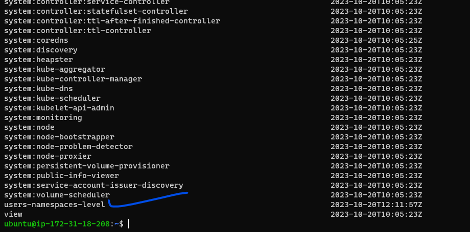

* **Lets create rolebinding for user muthu and bond with clusterrole:**

```
---
apiVersion: rbac.authorization.k8s.io/v1
kind: RoleBinding
metadata: 
  name: ClusterRole-rolebinding
  labels:
    namespace: develop
subjects:
- apiGroup: rbac.authorization.k8s.io
  kind: User
  name: muthu
roleRef:
  apiGroup: rbac.authorization.k8s.io
  kind: ClusterRole
  name: users-namespaces-level 
```

```
# i am applying all the roles from my admin kubernetes
# while applying the rolebinding needs to apply from admin but needs apply in particular namespace because 
# rolebinding works only on namespaces, if not we unable to access the api resources
vi clusterrole-rolebinding.yaml
kubectl apply -f clusterrole-rolebinding.yaml -n develop
kubectl get rolebinding
```


* Resources created in develop namespaces

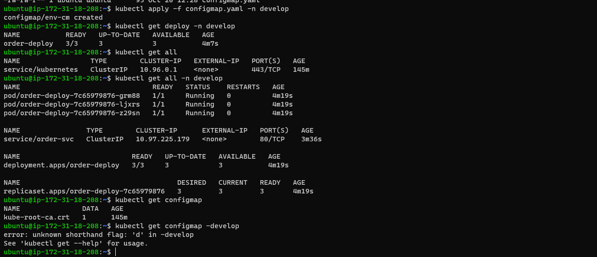

* observe below screenshots user muthu can access all the resources in the develop namespace even though we have used clusterrole.


* user muthu unable to get resources from other namespaces, why because rolebinding works only with in the rolebinding namespace so. if we want access other namespaces resources then needs to bond clusterrole with clusterrolebinding

* user muthu unable to get cluster resources, why because clusterrole bond with rolebinding means rolebinding have limit up to particular namespace only 
if we want access other cluster scope resources then needs to bond clusterrole  with clusterrolebinding


* **Lets create rolebinding for user bala and bond with same clusterrole we used for muthu:**

```
---
apiVersion: rbac.authorization.k8s.io/v1
kind: RoleBinding
metadata: 
  name: ClusterRole-rolebinding
  labels:
    namespace: develop
subjects:
- apiGroup: rbac.authorization.k8s.io
  kind: bala
  name: muthu
roleRef:
  apiGroup: rbac.authorization.k8s.io
  kind: ClusterRole
  name: users-namespaces-level 
```
```
# i am applying all the roles from my admin kubernetes
# while applying the rolebinding needs to apply from admin but needs apply in particular namespace because 
# rolebinding works only on namespaces, if not we are to access the api resources
vi clusterrole-rolebinding.yaml
kubectl apply -f clusterrole-rolebinding-bala.yaml -n prod
kubectl get rolebinding -n prod
```
* observe here we have used same clusterrole for even bala.


* user bala able to access all the api resources in the prod namespace

* user bala unable to access api resources from other namespace and also cluster scope resources, why because rolebinding is namespaced level/limit, if we needs to access other namespace resources and cluster scoped resources then bind clusterrole with clusterrolebinding


### Now Lets do the experiment on above user muthu and bala with cluster role and bond with clusterrolebinding:

* **Lets create clusterrole both same for user muthu and bala:**

```
---
apiVersion: rbac.authorization.k8s.io/v1
kind: ClusterRole
metadata:
  name: users-namespaces-level
rules:
- apiGroups: ["*"] 
  resources: ["deployments","services","pods","configmaps","replicationcontrollers","namespaces","nodes","persistentvolumes","storageclasses"]
  verbs: ["get","list","delete","update","create", "watch"]
```

           or 

```
---
apiVersion: rbac.authorization.k8s.io/v1
kind: ClusterRole
metadata:
  name: users-namespaces-level
rules:
- apiGroups: ["*"]
  resources: ["*"]
  verbs: ["*"]
```
```
# we can apply from admin kubernetes to even default namesapce since clusterrole works on cluster scope 
vi clusterrole-users.yaml
kubectl apply -f clusterrole-users.yaml
kubectl get clusterrole
or
kubectl get clusterrole users-namespaces-level
```
* **Lets create clusterrolebinding for user muthu:**

```
---
apiVersion: rbac.authorization.k8s.io/v1
kind: ClusterRoleBinding
metadata:
  name: muthu-ClusterRoleBinding
subjects:
- apiGroup: rbac.authorization.k8s.io
  kind: User
  name: muthu
roleRef:
  apiGroup: rbac.authorization.k8s.io
  kind: ClusterRole
  name: users-namespaces-level
```
```
# clusterrolebinding can applyng from admin kuberbetes default namespace also because it is cluster scoped
kubectl apply -f clusterrolebinding-muthu.yaml
kubectl get clusterrolebinding
or
kubectl get clusterrolebinding muthu-ClusterRoleBinding
```


* check this below screen shots we can able to access resources in all the namespaces and also we can access cluster resources like nodes,namespaces,pv,sc


* **Explaination Even bala user also same as above we seen examples for muthu so i am not doing demonstration for bala user.**

### About permissions symbols:

* **apiGroups:** 
   * [""] => this means indicates the core API group
   * ["*"] => this means indicates all API Group
* **resources:**
   *  ["*"] => indicates all the Api Resources
      or
   *  ['\*'] => represents all resources.   
* **verbs:**
  *  ["*"] => all permissions on API Resources
  * ['\*'] represents all verbs operations

---

## Service Accounts:
* [Refer Here](https://kubernetes.io/docs/concepts/security/service-accounts/) youtube
* [Refer Here](https://www.youtube.com/watch?v=ECTxTONWgw8) youtube
* Service Account is an user account for non human (like AWS roles,kubernetes dashboard and monitoring etc:)
* service accounts are used by pods to access kubernetes api server
* Service Account represents some application/Pod/whatever running inside k8s cluster and needs to access k8s api’s
* kubernetes cluster comes with a service account called as `default` which lives in `default` name space.
* Any pod which we create where we don’t explicitly assign a service account to created pod, it uses the default service account.
* A service account is a type of non-human account 
* When you create a cluster, Kubernetes automatically creates a ServiceAccount object named `default` for every namespace in your cluster. The `default` service accounts in each namespace get no permissions by default other than the `default API discovery permissions` 
* If you delete the `default` ServiceAccount object in a namespace, the `control plane` replaces it with a `new one`.
* If you deploy a Pod in a namespace, and you don't `manually assign a ServiceAccount to the Pod`, Kubernetes assigns the `default` ServiceAccount for that namespace to the Pod
* **Please Note Below Important:**
  * when we create kubernetes cluster a default namespace is created with that a default service account also created, so when we create a pod, which our application is running inside the pod, so the pod uses the default service account to authenticate them
self with kube api server, in case if we dont explicitly assign a custom service account to a pod


### Experiment on Service Account:

#### Activity:1
* Whenever we create a namespace a service account called as `default` is created


* For every pod create in `/var/run/secrets/kubernetes.io/serviceaccount` a certificate and token are mounted to access to API Server

#### Example:1
* Lets create nginx pod and see pod uses default service account:
* The credentials donot have permission to access kube apiserver below examples
* this below script uses to interact with Api server.

```
APISERVER=https://kubernetes.default.svc
SERVICEACCOUNT_DIR=/var/run/secrets/kubernetes.io/serviceaccount
TOKEN=$(cat ${SERVICEACCOUNT_DIR}/token)
CACERT=${SERVICEACCOUNT_DIR}/ca.crt
curl --cacert ${CACERT} --header "Authorization: Bearer ${TOKEN}" -X GET ${APISERVER}/api/v1/namespaces/default/pods
```
* create nginx pod in imperative way:

` kubectl run nginx --image=nginx:latest`
* observe here below when create a pod with out explicitly assigning a custom service account. so in this case a pod uses its default service account which a pod cannot access a api server resources below examples.


#### Observe below example of create our own service account with assigning to pod.
* Lets create our own service account
  * imperative way of creating service account
`kubectl create serviceaccount custom-sa`  


* Lets assign permissions to service account `custom-sa`

```
 kubectl create rolebinding custom-sa-readonly \
    --clusterrole view \
    --serviceaccount=default:custom-sa \
    --namespace=default
```


* Lets assign custom created service account to a pod

```yaml
apiVersion: v1
kind: Pod
metadata:
  name: nginx-sa-demo
spec:
  serviceAccountName: custom-sa
  containers:
    - name: nginx
      image: nginx
```

* Now lets interact with kube-apiserver using the below script

```
APISERVER=https://kubernetes.default.svc
SERVICEACCOUNT_DIR=/var/run/secrets/kubernetes.io/serviceaccount
TOKEN=$(cat ${SERVICEACCOUNT_DIR}/token)
CACERT=${SERVICEACCOUNT_DIR}/ca.crt
curl --cacert ${CACERT} --header "Authorization: Bearer ${TOKEN}" -X GET ${APISERVER}/api/v1/namespaces/default/pods
```
* Now oberve below screen shot that we have assinged our custom service account to a pod, so that pod uses our sa and communicate to api server.


```
ubuntu@ip-172-31-21-80:~$ kubectl exec -it nginx-sa-demo -- /bin/bash
root@nginx-sa-demo:/# APISERVER=https://kubernetes.default.svc
SERVICEACCOUNT_DIR=/var/run/secrets/kubernetes.io/serviceaccount
TOKEN=$(cat ${SERVICEACCOUNT_DIR}/token)
CACERT=${SERVICEACCOUNT_DIR}/ca.crt
curl --cacert ${CACERT} --header "Authorization: Bearer ${TOKEN}" -X GET ${APISERVER}/api/v1/namespaces/default/pods
{
  "kind": "PodList",
  "apiVersion": "v1",
  "metadata": {
    "resourceVersion": "11053"
  },
  "items": [
    {
      "metadata": {
        "name": "kubectl-pod",
        "namespace": "default",
        "uid": "c1467a09-f5a4-470a-a970-e4e755cb929b",
        "resourceVersion": "9112",
        "creationTimestamp": "2023-10-22T09:24:46Z",
        "annotations": {
          "kubectl.kubernetes.io/last-applied-configuration": "{\"apiVersion\":\"v1\",\"kind\":\"Pod\",\"metadata\":{\"annotations\":{},\"name\":\"kubectl-pod\",\"namespace\":\"default\"},\"spec\":{\"containers\":[{\"command\":[\"sleep\",\"20000\"],\"image\":\"bitnami/kubectl\",\"name\":\"kubectl\"}]}}\n"
        },
        "managedFields": [
          {
            "manager": "kubectl-client-side-apply",
            "operation": "Update",
            "apiVersion": "v1",
            "time": "2023-10-22T09:24:46Z",
            "fieldsType": "FieldsV1",
            "fieldsV1": {
              "f:metadata": {
                "f:annotations": {
                  ".": {},
                  "f:kubectl.kubernetes.io/last-applied-configuration":
                  root@nginx-sa-demo:/#
```

* Security Risk: It is generally recommended to disable automount feature [Refer Here](https://microsoft.github.io/Threat-Matrix-for-Kubernetes/techniques/container%20service%20account/) To mitigate [Refer Here](https://kubernetes.io/docs/tasks/configure-pod-container/configure-service-account/#opt-out-of-api-credential-automounting)


### To view permissions of service account `kubectl auth can-i`

* This below command to view the permissions on default service account which is created on default namespace

` kubectl auth can-i --list --as="system:serviceaccount:default:default"`
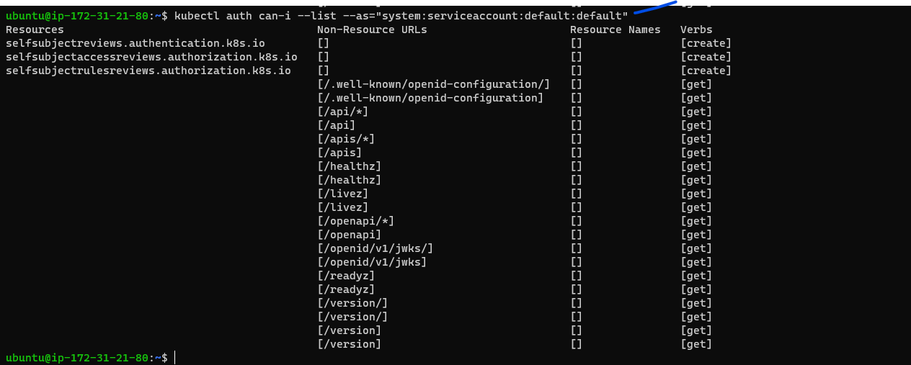

* This below command to view the permission on custom created service account on default namespace

` kubectl auth can-i --list --as="system:serviceaccount:default:custom-sa"`
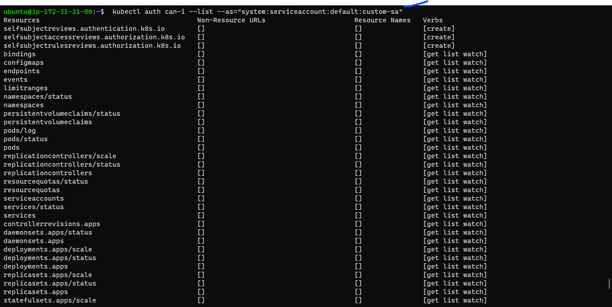


#### Example:2 
* a example that pod uses default service account and unable to access the api server 

```yaml
apiVersion: v1
kind: Pod
metadata:
  name: kubectl-pod
spec:
  containers:
  - name: kubectl
    image: bitnami/kubectl
    command: ["sleep", "20000"]
```
```
vi kubectl-pod.yaml
kubectl apply -f kubectl-pod.yaml
kubectl exec -it kubectl-pod -- bash
kubectl get pods
```


* Lets create a service account and assign to above pod and check the status of access to api server

```
kubectl create sa test-sa
kubectl get sa
kubectl get sa  test-sa -o yaml
```
```yaml
apiVersion: v1
kind: ServiceAccount
metadata:
  creationTimestamp: "2023-10-22T10:56:57Z"
  name: test-sa
  namespace: default
  resourceVersion: "16864"
  uid: 1ef17527-16d4-448b-b96e-9e007ed217ac
```
* Lets assign pod to newly created sa

```yaml
apiVersion: v1
kind: Pod
metadata:
  name: kubectl-pod
spec:
  serviceAccount: test-sa
  containers:
  - name: kubectl
    image: bitnami/kubectl
    command: ["sleep", "20000"]
```

```
vi kubectl-pod.yaml
kubectl apply -f kubectl-pod.yaml
kubectl get pods
```


`kubectl exec -it kubectl-pod -- /bin/bash`

* observe this below screen shot now pod is using the custom service account which we created it. but still its unable to access api server because we have not attached any role/permission to this service account


* Now Lets add the role and bond with rolebinding this with adding  service account to get permission for this service account to access api server

* **Please Note:**
  * we can give permission or attach to service account any role or cluster role bond with rolebinding nor clusterrolebinding

#### Role:

```yaml
apiVersion: rbac.authorization.k8s.io/v1
kind: Role
metadata:
  name: pod-reader
rules:
- apiGroups: [""] # "" indicates the core API group
  verbs: ["get", "watch", "list"]
  resources: ["pods", "pods/log"]
  # resourceNames: ["nginx"]
```


#### RoleBinding:

```yaml
apiVersion: rbac.authorization.k8s.io/v1
# This role binding allows user "muthu" to read pods in the "default" namespace.
# You need to already have a Role named "pod-reader" in that namespace.
kind: RoleBinding
metadata:
  name: read-pods
subjects:
# You can specify more than one "subject"
- kind: User
  name: muthu # "name" is case sensitive
  apiGroup: rbac.authorization.k8s.io
- kind: ServiceAccount
  name: test-sa
roleRef:
  # "roleRef" specifies the binding to a Role / ClusterRole
  kind: Role #this must be Role or ClusterRole
  name: pod-reader # this must match the name of the Role or ClusterRole you wish to bind to
  apiGroup: rbac.authorization.k8s.io
# roleRef:
#   kind: ClusterRole
#   name: secret-reader
#   apiGroup: rbac.authorization.k8s.io
```


* pods uses service account to access the api server resources
* observe below screen shot after attaching service account to pods with rolebinding with role, pods now able to communicate with api server 


* To check permission service account:


### Example:3
#### Create a Role and view what a role can do by binding this to serviceaccount:

#### Secret-reader:
* Lets create a role called secret-reader who has access to only read secrets 
* Lets create a service account `sr-sa` attached (bounded) to secret-reader service account
* Lets create rolebinding and bond with role called secret-reader of service account `sr-sa`
  * [Refer Here](https://github.com/codesquareZone/KubernetesZone/commit/378ef2b8b16cee5e18b7dc5bbb7bfc8a5ed32cb6) for all above three yaml files

#### secret-pod-reader:
* Lets create a role called secret-pod-reader who has access to read both secrets and pods
* Lets create a  service account spr-sa attached (bounded) to secret-pod-reader service account also rolebind

  * [Refer Here](https://github.com/codesquareZone/KubernetesZone/commit/2a0a2f5dcc7574e4fa0f82b8564a8e0958656f61?diff=unified) for all above three yaml files

* Lets Apply all yaml files:


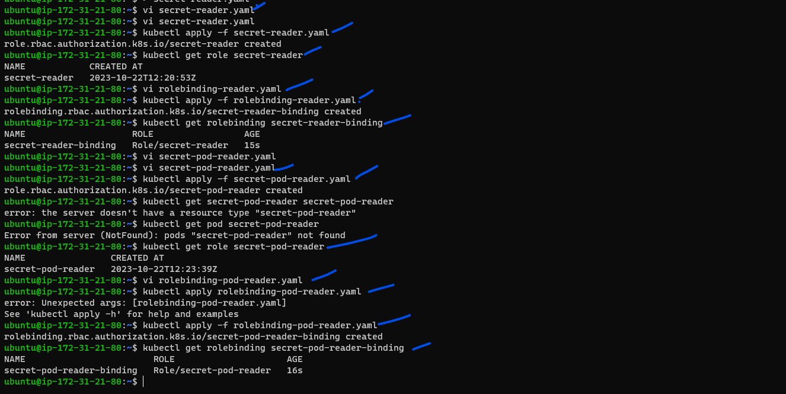

### View the permissions:

#### secret reader:

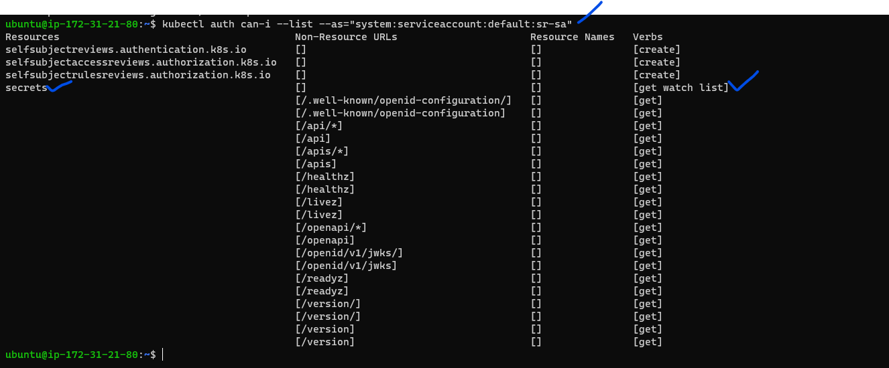

#### secret pod reader:

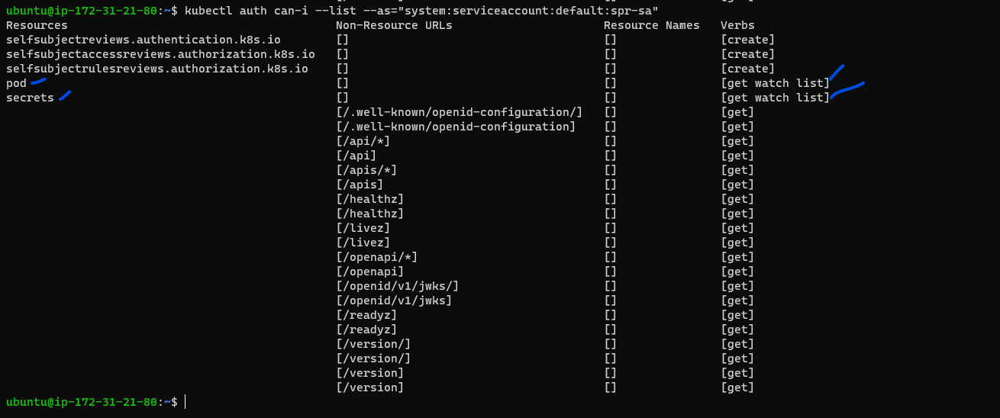

---

## Aggregating RBAC Rules:
* youtube video for aggregate rules [Refer Here](https://www.youtube.com/watch?v=gqhbnulGza4)
* Aggregation Rules means instead of having multiple clusterrole, we can have only one aggregated cluterrole.
* what this means, assume some scenario we have multiple cluterrole so we needs to rolebind or clusterrolebind with multiple clusterrole, this is unnecessarily waste of doing things, so in this case we can have multiple clusterrole created for these multiple clusterrole we have only one aggregated clusterrole and this will inherit the all other multiple clusterole by matching its label and so we can rolebind or clusterrolebind with only one aggregated clusterrole, instead of many.
* Existing multiple ClusterRoles can be aggregated to avoid having to define a multiple new set of clusterrole Rules 

### Experiment:
* Lets create two set of cluster role and one aggregated cluster role and will see how it will combine the other cluster role with matching label and allow us the operate on the rules mentioned on the multiple cluster role. 

#### Lets create a Cluster Role for listing pods:

```
---
apiVersion: rbac.authorization.k8s.io/v1
kind: ClusterRole
metadata:
  name: list-pods
  labels:
    rbac-list-pods: "true"
rules:
  - apiGroups: [""]
    resources: [pods]  
    verbs: [list]
```


#### Lets create a ClusterRole for deleting service:

```
---
apiVersion: rbac.authorization.k8s.io/v1
kind: ClusterRole
metadata:
  name: delete-service
  labels:
    rbac-delete-service: "true"
rules:
  - apiGroups: [""]
    resources: [service]  
    verbs: [delete] 
```


#### Now we can aggregate i.e combine the both above cluster role rules while composing a new aggregate cluster Role by name `aggr-sample`

```
---
apiVersion: rbac.authorization.k8s.io/v1
kind: ClusterRole
metadata:
  name: aggr-sample
aggregationRule:
  clusterRoleSelectors:
    - matchLabels:
        rbac-list-pods: "true"
    - matchLabels:
        rbac-delete-service: "true"
rules: []
```
* Observe this above aggregated cluster role will inherit the aboves said cluster role rules, since in aggregate cluster role i have ot mentioned any rules.
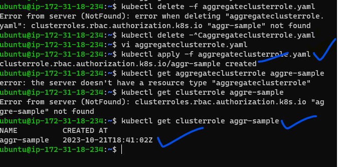


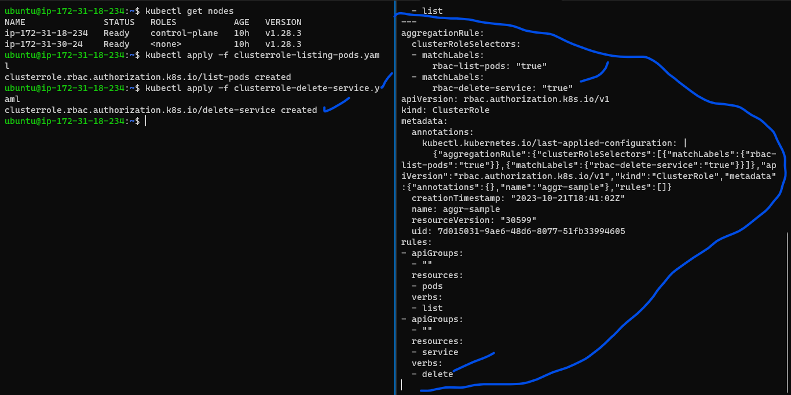
* have we observed the other two cluster role rules have been inherited in the aggregation cluster role rules column.

#### Now we can rolebind or clusterrolebind with aggregated cluster role to see the functions or operations working 

* in this examples i am bonding aggregated cluster role with rolebinding 

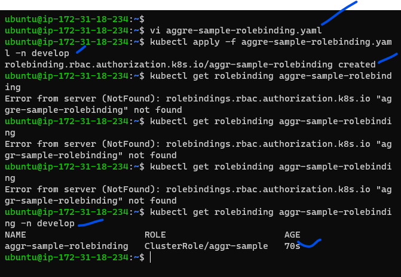


* as per the aggregated cluster role rules, we can get the pods and delete the services from develop namespace.
---

## Experiment:
* create a kubeadm cluster single-master
* create a user muthu with clusterlevel permissions
* create a kubeconfig for this user
* create a new linux machine and install kubectl and use the above generated kubeconfig and check if you can interact with k8s cluster using kubeconfig of muthu

#### This above experiment has been done:

* let me explain in short about it.
* i have copied .kube/config file to newly created linux machine and done few changes to .kube/config 
* changes like i have copied ca.crt and ca.key file to new linux machine and point the new location in the .kube/config file this was worked good
* same like above another option is instead of copying ca.crt and ca.key file we can convert that into base64 encode and directly we put encoded base64 details in the .kube/config file this will also work.
---

#### Another experiment:
* Trying from from external network like my laptop:


* this also same like above 
* just copy .kube/config file to your laptop and for changes to be done follow above steps.

#### Multiple lines to make in single line refer below
* [Refer Here](https://community.notepad-plus-plus.org/topic/14791/how-to-make-all-data-in-one-line)

---


