# Workshop `AWS`, `AzURE`, `CF`, `ARM-TEMPLATE`:
* Using Terraform and Jenkins for Automation. 
* all terraform code contain on below QT repo below link:
   * [Refer Here](https://github.com/asquarezone/TerraformZone/tree/master/july23/workshop)

### steps:1
* Take one linux ec2 machine
* name ec2 machine jenkins
* install jenkins

`systemctl status jenkins`

* follow the steps to up the jenkins `UI` in jenkins installation document

### steps:2
* Take one linux ec2 machune
* name ec2 machine as infraprovisioning 
* install terraform => follow the installation steps in terraform document

`terraform version`

* install awscli
   * [Refer Here](https://linuxhint.com/install_aws_cli_ubuntu/)

   `aws --version` 

* Configure aws
```
aws configure
AWS Access Key ID [None]: xxxxxxxxxxxxxxxxx
AWS Secret Access Key [None]: xxxxxxxxxxxxxxxxxxxx
Default region name [None]: us-west-2
Default output format [None]:
```    
* Execute below command to check aws connectivity

` aws s3 ls`

* install azurecli 
   * [Refer Here](https://learn.microsoft.com/en-us/cli/azure/install-azure-cli-linux?pivots=apt)

` az version`
* az login
  * 
  * 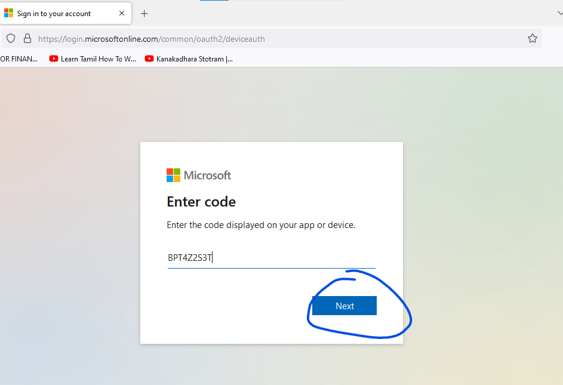
  * 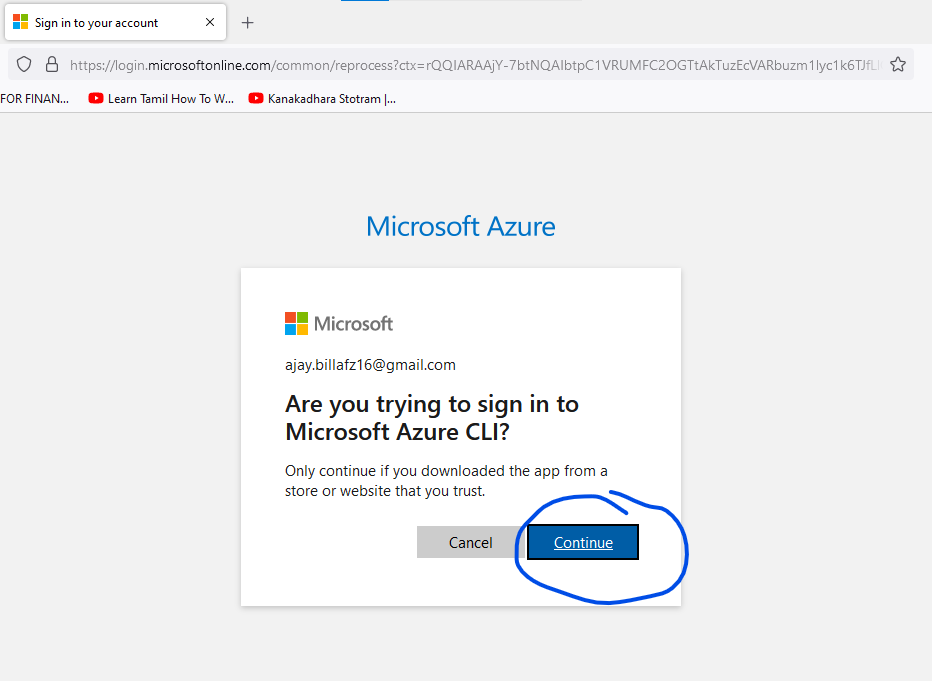
  * 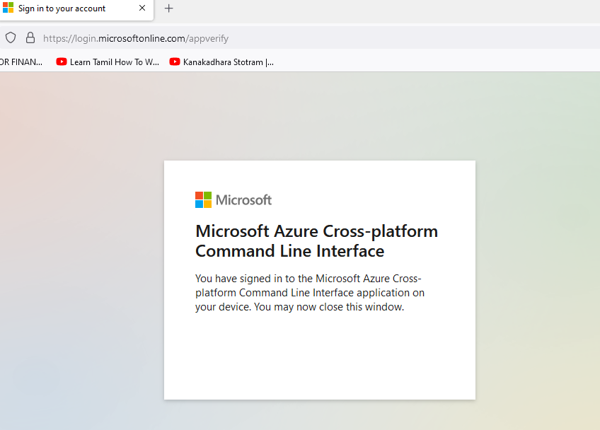
  * Output we will get like below, that means authentication is success

```
[
  {
    "cloudName": "AzureCloud",
    "homeTenantId": "d3283a09-d0ee-413b-acb4-2f1da18158bc",
    "id": "5e29be3b-772d-4a03-9b7a-9990573f645e",
    "isDefault": true,
    "managedByTenants": [],
    "name": "Azure subscription 1",
    "state": "Enabled",
    "tenantId": "d3283a09-d0ee-413b-acb4-2f1da18158bc",
    "user": {
      "name": "ajay.billafz16@gmail.com",
      "type": "user"
    }
  }
]
```
* Execute below command to check az connectivity
 
`az group list`

* install openjdk-17
   * `sudo apt install openjdk-17-jdk -y`

### Step:3

* Jenkins Node Configurations:
  * On jenkins `UI`
  * Click on `manage jenkins`
  
  * Click on `Nodes`
  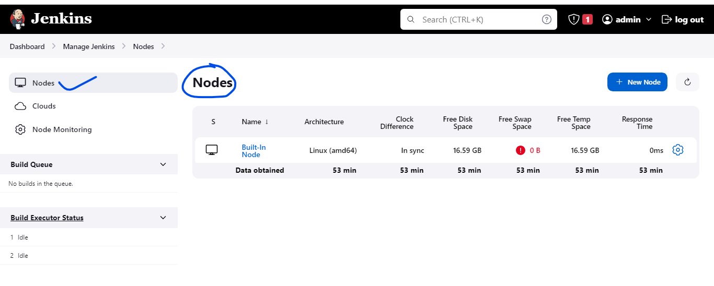
  * Click on `Add New Node`
  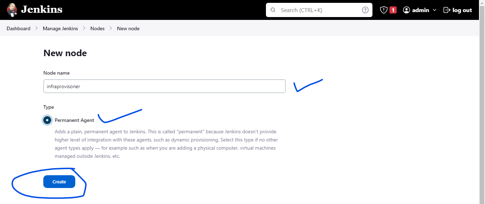
  
  
  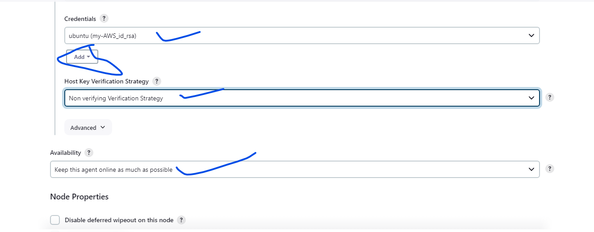
  
  
  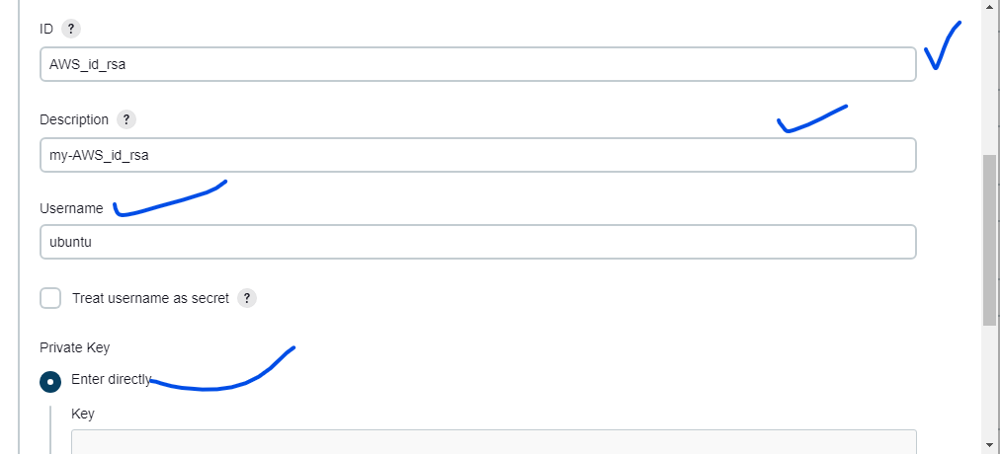
  * here if we using machine from `aws` means then we needs to give `.pem` file which aws created and stored in our local that is known as private key
  if `azure` means same as above.
  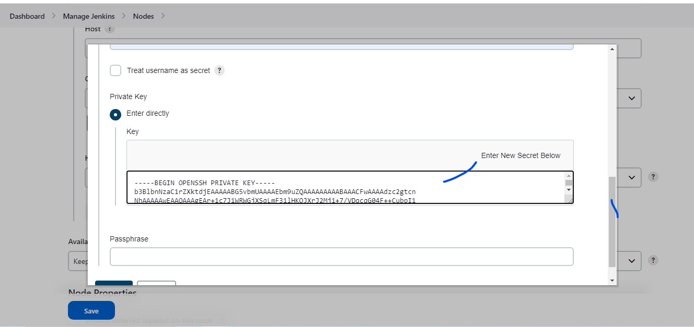
  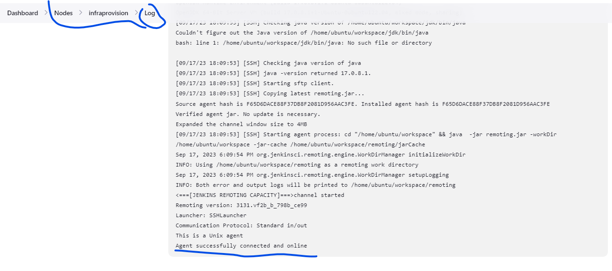
  * Node called `infraprovision` created successfully running online above log screen shot proves it. 

# AWS Pipeline:
* Now Step:4 is to write terraform code and execute using jenkins follow below all steps:

* Steps:
* prepare the terraform code for aws resource
  * [Refer Here](https://github.com/AjayKumarRamesh/QT-DevOps-AzureCloud-Trainings-Ajay/tree/master/Terraform/Terraform_Workshop/aws_tf_sample_code) 

* execute below commands before running this code into `jenkins UI` and if code is success or not.
   * ```
     terraform init
     terraform validate
     ```
*  Jenkins Free Style Project:
  * Click on New item
  * select free style
  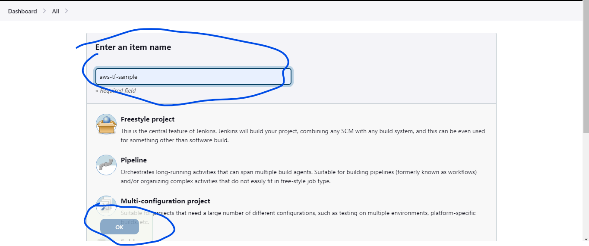
  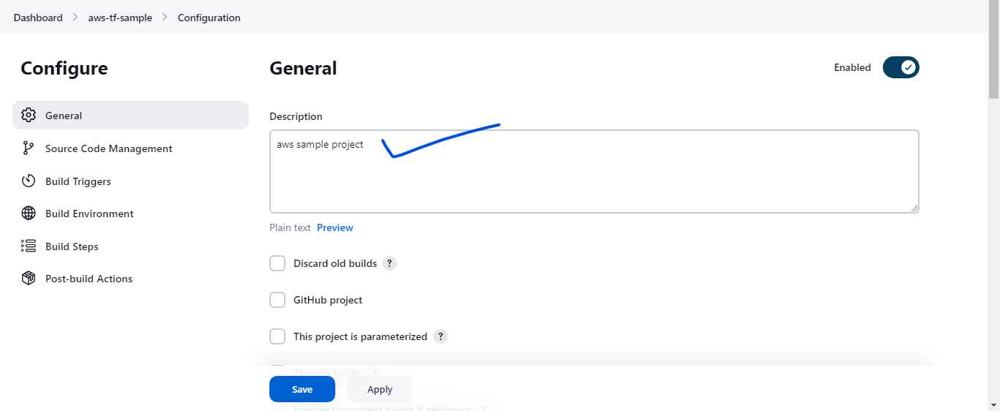
  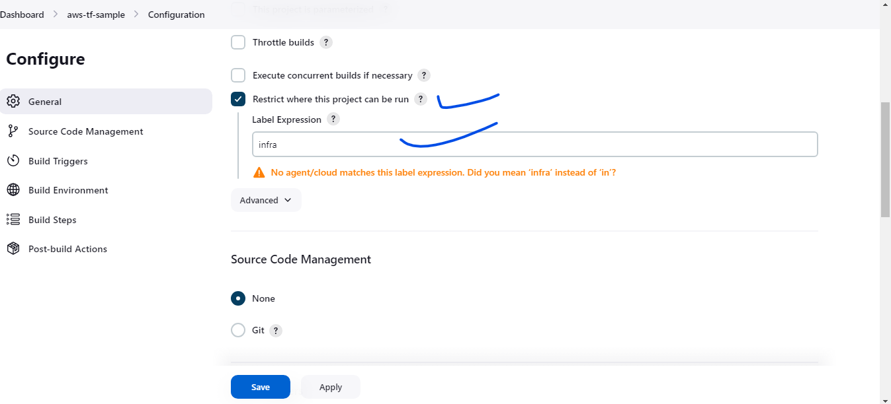
  
  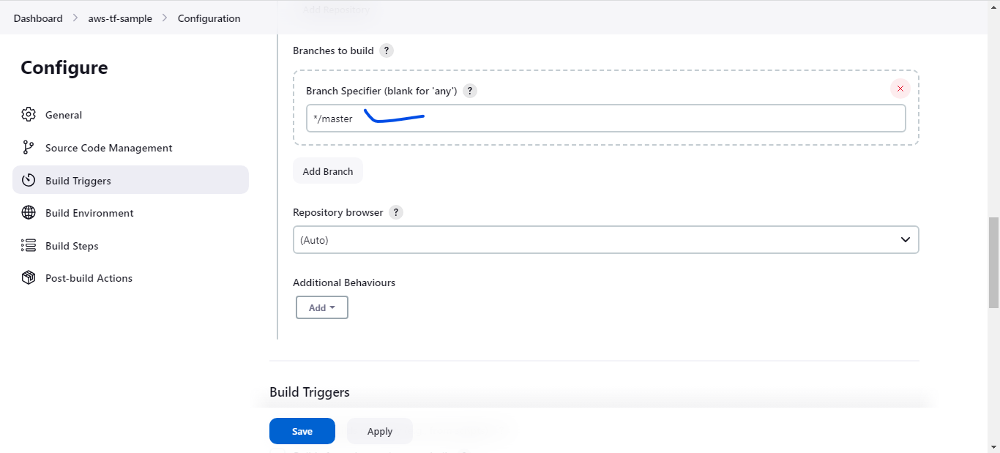
  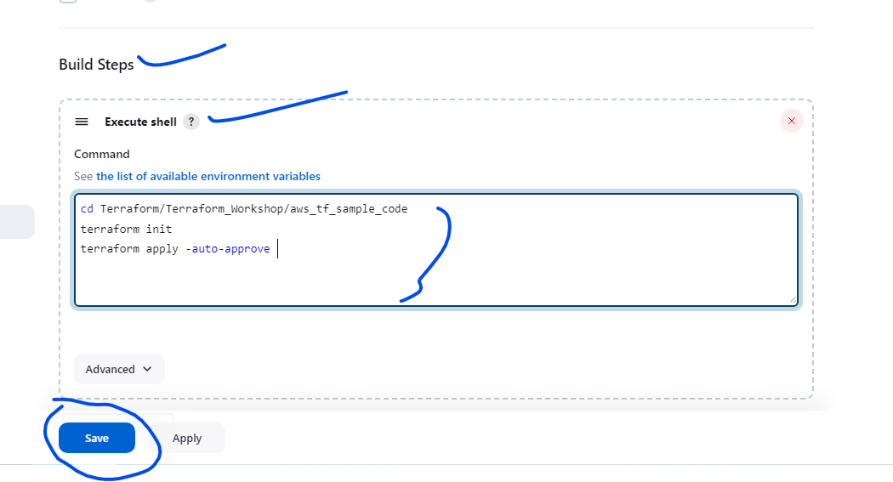
  
  
  * to destroy

  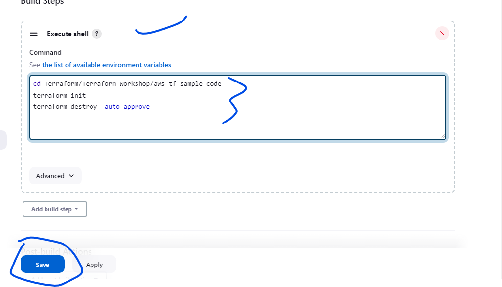

*  Jenkins  pipeline Project:

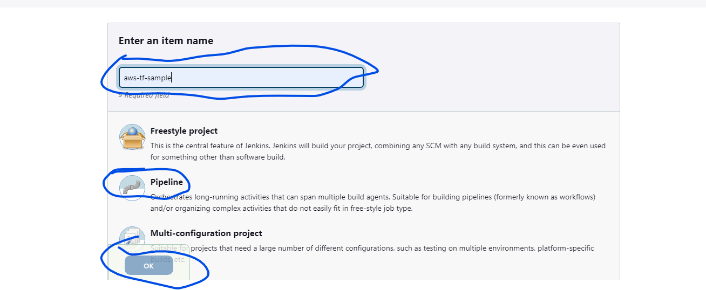
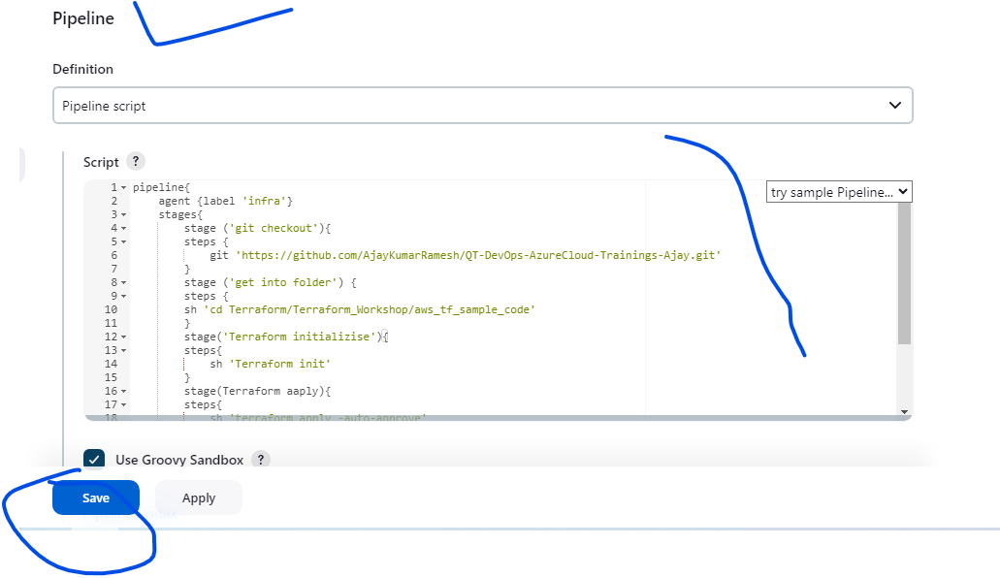
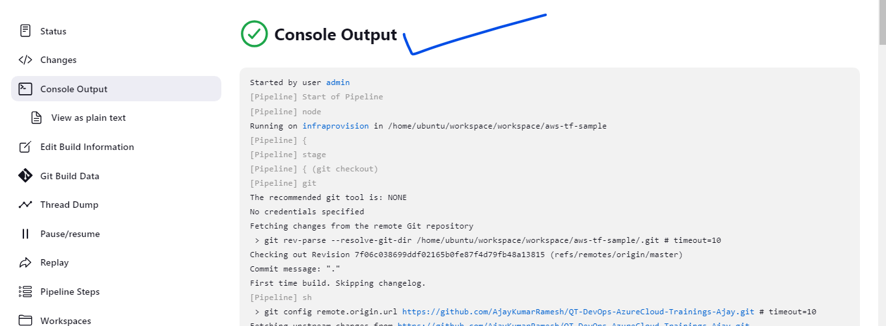

* below is pipeline code:

```

pipeline{
    agent {label 'infra'}
    stages{
        stage('git checkout'){
            steps{
                git 'https://github.com/AjayKumarRamesh/QT-DevOps-AzureCloud-Trainings-Ajay.git'
                sh 'cd Terraform/Terraform_Workshop/aws_tf_sample_code && terraform init && terraform apply -auto-approve'
               
               
                }
                
            

        }
    }
}
```
---

# Azure Pipeline:

* Now Step:4 is to write terraform code and execute using jenkins follow below all steps:
* Steps:
* prepare the terraform code for azure resource
* [Refer Here](https://github.com/AjayKumarRamesh/QT-DevOps-AzureCloud-Trainings-Ajay/tree/master/Terraform/Terraform_Workshop/azure_tf_sample_code)


* jenkins UI free style project  and pipeline please refer above aws steps:


* Jenkinsfile based project:

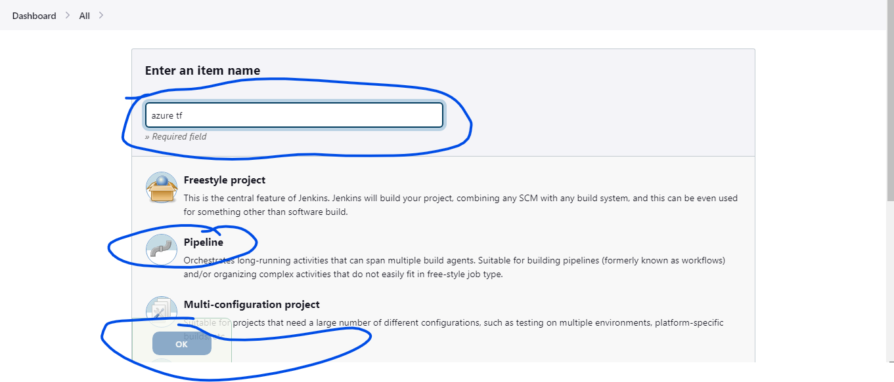


* Here below is jenkinsfile formate just prepare file called `Jenkinsfile` and place main folder of the repo as seen screen shot below:
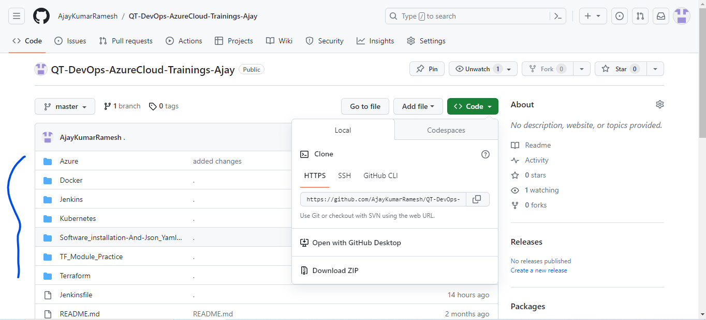

```
pipeline{
    agent {label 'infra'}
    stages{
        stage('git checkout'){
            steps{
                git 'https://github.com/AjayKumarRamesh/QT-DevOps-AzureCloud-Trainings-Ajay.git'
                sh 'cd Terraform/Terraform_Workshop/azure_tf_sample_code && terraform init && terraform destroy -auto-approve'
         }
        }
        }
        }
```
---

# Cloud Formation Pipeline:
Step:4 is to write terraform code and execute using jenkins follow below all steps:
* prepare the terraform code for azure resource
   * [Refer Here](https://github.com/AjayKumarRamesh/QT-DevOps-AzureCloud-Trainings-Ajay/blob/master/Terraform/Terraform_Workshop/CF_tf_sample_code/main.json) 
* Steps:
   * [Refer Here](https://docs.aws.amazon.com/AWSCloudFormation/latest/UserGuide/using-cfn-cli-creating-stack.html) and [Refer Here](https://awscli.amazonaws.com/v2/documentation/api/2.3.2/reference/cloudformation/create-stack.html)   for CF creation
* Manual commands to create a stack below:    
```
 aws cloudformation create-stack --stack-name testing --template-body file://main.json
 aws cloudformation   delete-stack --stack-name testing
```

* jenkins UI free style project  and jenkinsfile refer above aws and azure steps:

* CF running in Jenkins UI pipeline, if we want to run in github then create jenkinsfile and same copy the stuff from jenkins ui pipeline it will work
* CF running in Jenkins UI pipeline:

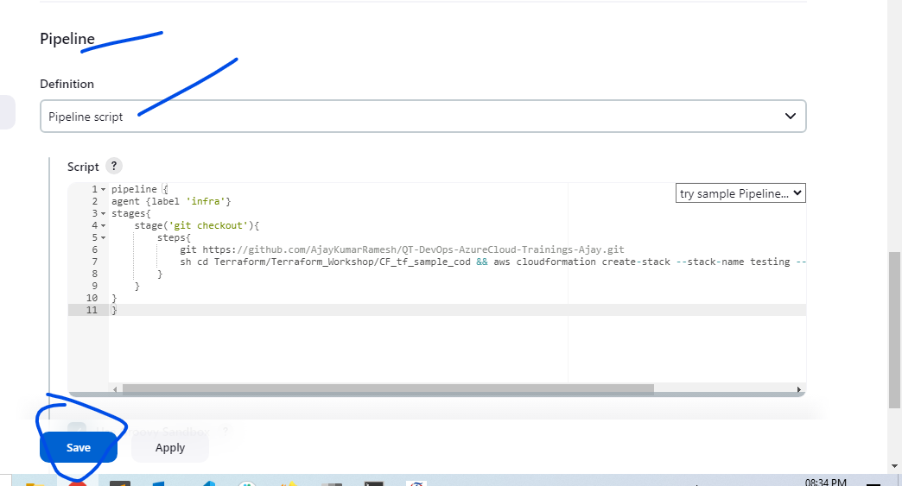

```
pipeline {
agent {label 'infra'}
stages{
    stage('git checkout'){
        steps{
            git https://github.com/AjayKumarRamesh/QT-DevOps-AzureCloud-Trainings-Ajay.git
            sh cd Terraform/Terraform_Workshop/CF_tf_sample_cod && aws cloudformation create-stack --stack-name testing --template-body file://main.json'
        }
    }
}
}
```


# ARM Template Pipeline:
* Step:4 is to write terraform code and execute using jenkins follow below all steps:
* prepare the terraform code for ARM Template resource
* [Refer Here](https://github.com/AjayKumarRamesh/QT-DevOps-AzureCloud-Trainings-Ajay/tree/master/Terraform/Terraform_Workshop/ARM_tf_sample_code) for ARM Template code

* Steps:
  * [Refer Here](https://learn.microsoft.com/en-us/azure/azure-resource-manager/templates/deploy-cli) for ARM Template creation manually 

```
az deployment group create --resource-group ajay --template-file ./main.json
az deployment group delete --resource-group ajay --name main
```
* jenkins UI pipeline and jenkinsfile refer above aws and azure steps:

* ARM running in Jenkins UI pipeline, if we want to run in github then create jenkinsfile and same copy the stuff from jenkins ui pipeline it will work

* ARM running in Jenkins UI freestyle:
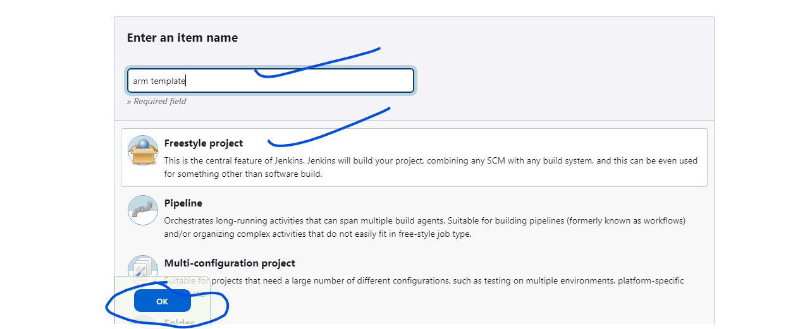
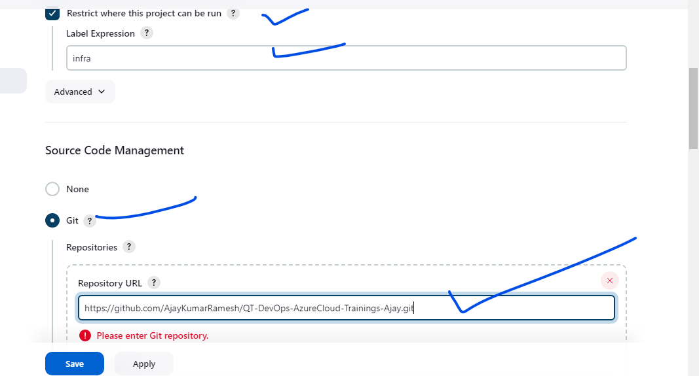
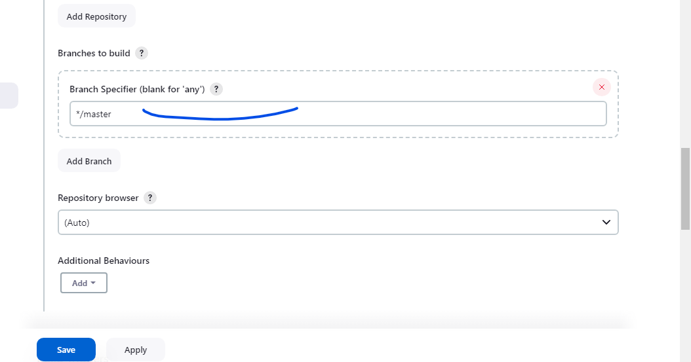
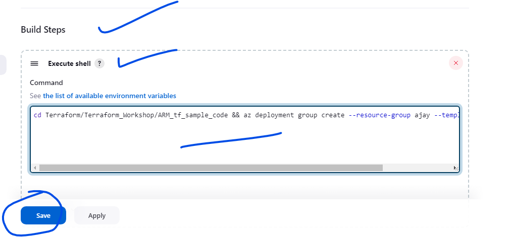

```
cd Terraform/Terraform_Workshop/ARM_tf_sample_code && az deployment group create --resource-group ajay --template-file ./main.json
 az deployment group delete --resource-group ajay --name main
```

---

